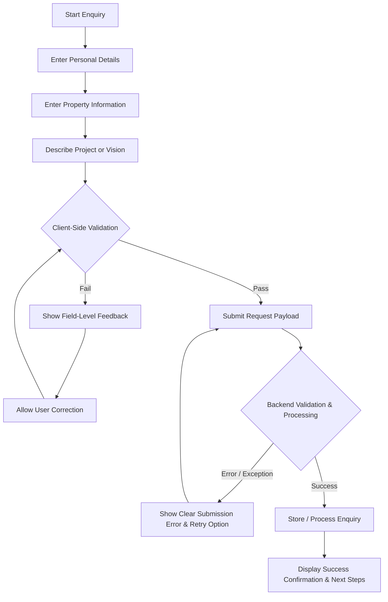

# Application Flow Document (APP_FLOW)

## 1. Document Information

| Attribute | Details |
| :--- | :--- |
| **Project Name** | Design Haven |
| **Repository** | FUTURE_PE_01 |
| **Document Type** | Application Flow Specification (APP_FLOW) |
| **Status** | Approved / Baseline Flow Specification |
| **Version** | 1.0.0 |
| **Last Updated** | 2026-08-19 |
| **Primary References** | [PRD.md](file:///e:/career/GYM/docs/PRD.md), [TRD.md](file:///e:/career/GYM/docs/TRD.md) |
| **Target Audience** | Product Managers, UX/UI Designers, Frontend Engineers, System Architects |

---

## 2. Application Overview

**Design Haven** is primarily an **inspiration-to-enquiry experience** rather than a rigid multi-step web application. Designed for creative homeowners, people renovating old properties, and individuals with homes under construction, the site provides an open, visual, and conceptual landscape that allows visitors to explore interior possibilities naturally before initiating a formal project dialogue.

Unlike conventional transactional platforms that enforce upfront registration, gating, or aggressive lead capture, Design Haven facilitates a psychological and functional progression grounded in six core visitor stages:

$$\text{Curiosity} \longrightarrow \text{Inspiration} \longrightarrow \text{Exploration} \longrightarrow \text{Possibility} \longrightarrow \text{Confidence} \longrightarrow \text{Action}$$

* **Curiosity:** The initial entry point where visual quality and space philosophy capture attention.
* **Inspiration:** Exposure to curated spatial transformations, mood direction, and architectural stories.
* **Exploration:** Unrestricted navigation across featured work, service capabilities, and spatial concepts.
* **Possibility:** The realization of how Design Haven's expertise applies to the visitor's specific home context (e.g., existing space refresh, old home renovation, or new construction).
* **Confidence:** Validation of Design Haven's process, spatial methodology, and execution capability.
* **Action:** The deliberate, low-friction decision to submit a structured project enquiry.

The application architecture prioritizes functional progression, system state predictability, and low-friction navigation, leaving visual implementation details decoupled from core flow logic.

---

## 3. Primary Visitor Flow

The primary functional progression describes the end-to-end journey of a visitor traversing the platform from initial arrival through successful enquiry submission.

```
Entry
  │
  ▼
Landing / Initial Context
  │
  ▼
Explore Inspiration and Possibilities
  │
  ▼
Understand Design Haven and Its Capabilities
  │
  ▼
Build Personal Relevance
  │
  ▼
Develop Project Intent
  │
  ▼
Access Project Enquiry
  │
  ▼
Validate Input
  │
  ▼
Submit
  │
  ▼
Receive Confirmation
```

### Stage Functional Descriptions

1. **Entry**
   * **System Behavior:** Accepts visitor incoming web traffic via direct domain URL, search engine landing, marketing referral, or specific section deep links. Initializes application context and session routing.

2. **Landing / Initial Context**
   * **System Behavior:** Establishes immediate spatial philosophy, brand identity, and site orientation. Presents visual anchoring and core value propositions without requiring immediate user action.

3. **Explore Inspiration and Possibilities**
   * **System Behavior:** Provides access to curated visual portfolios, spatial case studies, and design explorations. Allows filtering or browsing based on space types, style philosophies, and renovation contexts.

4. **Understand Design Haven and Its Capabilities**
   * **System Behavior:** Communicates service offerings, spatial transformation methodology, workflow phases, and professional capabilities. Translates visual aesthetics into clear operational outcomes.

5. **Build Personal Relevance**
   * **System Behavior:** Enables visitors to self-identify with relevant project contexts—whether seeking a creative refresh for an existing residence, structurally updating an older property, or designing a newly constructed build.

6. **Develop Project Intent**
   * **System Behavior:** Connects inspirational content with clear conversion prompts. Transitions the visitor's state from passive conceptual exploration to active consideration of their own residential project.

7. **Access Project Enquiry**
   * **System Behavior:** Opens the structured project enquiry flow. Form initializes in a clean, clear state, retaining any contextual parameters passed from prior content interactions where applicable.

8. **Validate Input**
   * **System Behavior:** Performs immediate client-side validation on field inputs (contact details, property status, project vision) to ensure data complete sanity prior to network submission.

9. **Submit**
   * **System Behavior:** Packages validated enquiry data into a structured payload and transmits it to backend service endpoints via API integration protocols.

10. **Receive Confirmation**
    * **System Behavior:** Upon receipt of API success status, updates user interface state to display a clear success confirmation, summary of submission, and anticipated follow-up timeline.

---

## 4. Navigation Flow

The navigation model for Design Haven is explicitly **non-linear**. Visitors must never be forced down a singular funnel or locked into a sequential pathway. They retain complete freedom to jump directly to any major functional area based on their immediate intent.

### Functional Destinations

While precise copy and labels may be refined during final brand styling, the navigation system supports direct access across the following core functional destinations:

* **Home:** The primary entry point establishing global context, core value proposition, and access to all secondary destinations.
* **Explore / Inspiration:** The central repository of visual imagery, spatial concepts, and aesthetic directions.
* **Services / Capabilities:** Detailed functional breakdown of interior design services, architectural spatial planning, and execution scope.
* **Featured Work or Design Exploration:** In-depth case studies illustrating real-world transformations, before-and-after spatial narratives, and project highlights.
* **Design Process / Understanding:** Clear explanation of how Design Haven operates, phase-by-phase client collaboration steps, and project delivery frameworks.
* **Project Enquiry:** The dedicated functional gateway for submitting detailed project inquiries and starting a professional engagement.

### Navigation Rules

1. **Global Accessibility:** All primary functional destinations remain accessible from any location within the application.
2. **State Preservation:** Navigating between informational destinations does not clear active form progress or reset session parameters.
3. **Deep Linking:** Direct URL access to any functional destination (e.g., direct navigation to Services or Featured Work) must fully load the required context without forcing a redirection to Home.

---

## 5. Conversion Flow

Design Haven employs a **content-led conversion strategy**. The conversion mechanism avoids high-pressure tactics (e.g., disruptive popups, forced registration, or hidden content behind lead gates) and instead embeds natural conversion triggers alongside inspirational and informative content.

### Conversion Progression

```
Content Exploration
(Inspiration / Work / Services)
       │
       ▼
Contextual Intent Triggers
(Embedded conversion prompts alongside case studies & capabilities)
       │
       ▼
Self-Initiated Transition
(Visitor clicks to start enquiry with clear expectation)
       │
       ▼
Structured Project Enquiry
```

### Conversion Dynamics

* **Contextual Hooks:** Conversion entry points are placed organically within case studies, service descriptions, and process explanations.
* **Low-Friction Transition:** Clicking a conversion trigger directs the user smoothly into the Project Enquiry flow without loss of browsing context.
* **Informative Expectation:** Before entering the enquiry form, visitors understand the purpose of the enquiry (e.g., scheduling a consultation or receiving spatial project evaluation) and what information will be required.

---

## 6. Project Enquiry Flow

The Project Enquiry flow collects essential project details necessary to qualify and prepare for a meaningful client consultation. It operates as a structured, clear functional sequence.

### Enquiry Progression Diagram



### Functional Flow Steps

1. **Start Enquiry:** User initiates enquiry action from navigation or contextual content hooks. Form state initializes.
2. **Enter Personal Details:** Captures client contact parameters:
   * Full Name
   * Email Address
   * Phone Number / Preferred Contact Method
3. **Enter Property Information:** Captures physical property context:
   * Property Status (e.g., Existing Residence Refresh, Old Property Renovation, New Build under construction)
   * Location / City
   * Estimated Timeline
4. **Describe Project or Vision:** Captures spatial requirements and aesthetic intent:
   * Project Scope (e.g., Full Home, Specific Rooms, Structural Reconfiguration)
   * Aesthetic / Spatial Preferences
   * Additional Notes / Vision Details
5. **Client Validation:** System evaluates inputs prior to network request.

### Validation Handling

* **Validation Failure:**
  * System identifies specific invalid or missing fields.
  * Displays clear, understandable field-level feedback inline.
  * Form focus remains accessible; all valid fields retain user input without data wipe.
  * User makes corrections and re-submits validation.
* **Validation Success:**
  * System constructs structured payload.
  * Triggers asynchronous HTTP POST submission to backend processing endpoint.
  * Displays non-blocking pending/loading system state.
  * Evaluates backend API response:
    * **Backend Validation Error / Server Failure:** Displays user-friendly error notification with actionable retry trigger. Form state remains fully intact.
    * **Backend Processing Success:** Clears form state in memory and renders receipt confirmation view with explicit next steps.

---

## 7. Error and Recovery Flow

To maintain user trust and minimize friction, the application implements robust error handling and recovery protocols across all interaction points.

```
Error Condition Detected
       │
       ├─► Invalid Input ─────► Highlight Affected Field ──► Preserve Form Data ──► Allow Immediate Correction
       │
       └─► Failed Submission ─► Show Readable Notification ─► Retain Data Payload ──► Enable Retry Action
```

### Error Scenarios & Recovery Protocols

| Error Scenario | Cause / Trigger | System Behavior | Recovery Mechanism |
| :--- | :--- | :--- | :--- |
| **Invalid Field Input** | Missing required fields, malformed email, or invalid phone characters during client validation. | Highlights failing field(s) with clear, human-readable error messages immediately adjacent to inputs. | Retains all valid entered data. User corrects specific field; validation re-evaluates automatically or on re-submission. |
| **Network Failure** | Lost connectivity, network timeout, or offline status during enquiry submission. | Displays clear offline/network failure notice indicating the request could not reach the server. | Form payload remains buffered in memory. Provides a manual "Retry Submission" action once connection is restored. |
| **Backend Validation Error** | Server-side validation failure (e.g., rate limit exceeded, unexpected payload format). | Displays user-friendly notification translating technical response into plain language. | Retains form data completely so user does not need to re-type details. |
| **System Exception / Endpoint Unavailable** | HTTP 500 server error or service maintenance during API call. | Renders polite error message explaining temporary unavailability and alternative contact guidance. | Logs error details internally while offering the user a retry option or direct email fallback link. |

### Recovery Principles

1. **Zero Data Loss:** Under no error condition should valid user input be wiped or discarded.
2. **Clear Feedback:** Error notifications must use plain, non-technical language explaining what went wrong and how to fix it.
3. **Actionable Retries:** Every failure state must provide a single-click mechanism to retry the operation.

---

## 8. Alternate Entry Paths

While the primary flow assumes entry through the home landing experience, visitors may enter Design Haven via multiple alternate routes depending on acquisition source or user intent.

```
┌────────────────────────────────────────────────────────┐
│                   Alternate Entries                    │
└───────────────────┬────────────────┬───────────────────┘
                    │                │
     Direct Deep Link                │          High-Intent Referral
     (e.g., Featured Case Study)     │          (e.g., Ad or Direct Link)
                    │                │                    │
                    ▼                │                    ▼
┌───────────────────────┐            │         ┌─────────────────────┐
│  Explore Content      │            │         │  Project Enquiry    │
│  (Featured Work Page) │            │         │  (Direct Form View) │
└───────────┬───────────┘            │         └──────────┬──────────┘
            │                        │                    │
            ▼                        ▼                    ▼
┌────────────────────────────────────────────────────────────────────┐
│                    Design Haven Application State                  │
└────────────────────────────────────────────────────────────────────┘
```

### Supported Entry Modes

1. **Direct Deep Links (Content Entry):**
   * Visitors landing directly on a specific featured project or service category (e.g., from search results or social media shares).
   * **System Behavior:** Initializes full application shell, context, and global navigation. Displays target content directly without forcing a home page redirect.

2. **High-Intent Direct Entry (Enquiry Entry):**
   * Returning visitors or targeted campaign traffic navigating directly to the Project Enquiry destination.
   * **System Behavior:** Loads the project enquiry interface immediately while maintaining access to navigation for users who wish to verify credentials or browse work first.

3. **Informational Research Entry:**
   * Visitors entering directly onto the Design Process or Capabilities pages.
   * **System Behavior:** Provides immediate answer to capability/process questions, with organic conversion options to explore work or begin an enquiry.

---

## 9. Flow Principles

The application flow of Design Haven is governed by six immutable design and interaction principles:

1. **No Forced Linear Journey:** Visitors are never locked into mandatory step sequences or forced funnel progression. They can browse, jump, or return to any area at will.
2. **Clear Next Actions:** Every section and state provides obvious, intuitive next steps without creating ambiguity or decision paralysis.
3. **Low Cognitive Friction:** Content presentation, navigation mechanics, and form inputs are structured to minimize mental effort and complexity.
4. **Contextual Conversion Points:** Opportunities to convert into a project enquiry appear naturally alongside high-value visual and informational content.
5. **Ability to Explore Freely:** Visitors are encouraged to inspect spatial case studies, process explanations, and portfolio galleries without high-pressure lead gates.
6. **Clear Recovery from Errors:** System failures or input errors provide immediate, constructive feedback and preserve user state to guarantee effortless correction.

---

## 10. Flow Summary

The overall application flow is summarized in the following Mermaid diagram, illustrating the integration of primary navigation, content exploration, contextual conversion, enquiry form validation loops, and error recovery states.

```mermaid
flowchart TD
    %% Entry Points
    Entry Direct / Search / Social --> NavigationRouter[Navigation Router]

    %% Navigation Router Destination Branching
    NavigationRouter --> Home[Home / Initial Context]
    NavigationRouter --> Explore[Explore / Inspiration Gallery]
    NavigationRouter --> Services[Services & Capabilities]
    NavigationRouter --> Work[Featured Work / Case Studies]
    NavigationRouter --> Process[Design Process & Methodology]
    NavigationRouter --> Enquiry[Project Enquiry Flow]

    %% Content Exploration Interconnections
    Home <--> Explore
    Home <--> Services
    Explore <--> Work
    Services <--> Process
    Work <--> Process

    %% Organic Conversion Hooks
    Home -- Organic CTA --> Enquiry
    Explore -- Organic CTA --> Enquiry
    Services -- Organic CTA --> Enquiry
    Work -- Organic CTA --> Enquiry
    Process -- Organic CTA --> Enquiry

    %% Project Enquiry Sub-Flow
    subgraph EnquiryFlow [Project Enquiry Flow]
        Enquiry --> PersonalDetails[1. Enter Personal Details]
        PersonalDetails --> PropertyInfo[2. Enter Property Information]
        PropertyInfo --> ProjectVision[3. Describe Project or Vision]
        ProjectVision --> ClientValidate{Validate Inputs?}

        ClientValidate -- Invalid --> FormError[Show Inline Field Errors & Preserve Input]
        FormError --> PersonalDetails

        ClientValidate -- Valid --> SubmitAPI[Send HTTP Submission to Backend]
        SubmitAPI --> ServerValidate{Server / Network Status}

        ServerValidate -- Network Failure / Server Error --> NetworkError[Show Submission Error Notice & Retain Data]
        NetworkError -- Click Retry --> SubmitAPI

        ServerValidate -- Success 200 OK --> Confirmation[Display Success Confirmation & Next Steps]
    end

    %% Post-Submission Navigation
    Confirmation --> ReturnHome[Return to Home / Continue Exploration]
    ReturnHome --> NavigationRouter
```

---
