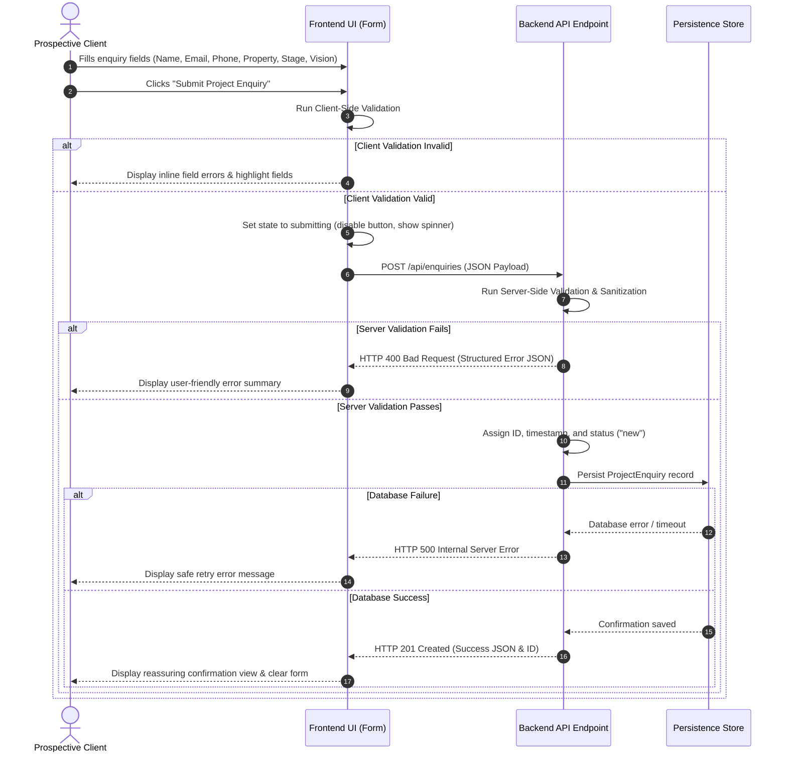

# Backend Schema Specification

## 1. Document Information

| Attribute | Details |
| :--- | :--- |
| **Project Name** | Design Haven |
| **Repository** | FUTURE_PE_01 |
| **Document Name** | Backend Schema Specification |
| **Version** | 1.0.0 |
| **Status** | Approved Baseline Specification |
| **Purpose** | Define the logical data architecture, entity models, API contracts, submission workflows, validation rules, security practices, and privacy guidelines for the Version 1 backend of Design Haven. |
| **Product References** | [PRD.md](file:///e:/career/GYM/docs/PRD.md), [TRD.md](file:///e:/career/GYM/docs/TRD.md), [APP_FLOW.md](file:///e:/career/GYM/docs/APP_FLOW.md) |

---

## 2. Backend Overview

The Version 1 backend for Design Haven exists primarily to support the project enquiry workflow. It is designed to receive, validate, process, and securely persist project enquiries generated by prospective clients through the Design Haven web interface.

The backend architecture is deliberately designed to remain simple, technology-neutral, and scalable:
* **Purpose-Driven Scope:** Focuses entirely on capturing, validating, and managing incoming project enquiries without unnecessary architectural complexity.
* **Technology Neutrality:** Does not lock the project into a specific backend framework, programming language, database engine (SQL or NoSQL), ORM, cloud vendor, or hosting provider.
* **Decoupled Architecture:** Operates as a stateless backend service accepting structured JSON requests and returning standardized JSON responses.
* **Future-Ready Scalability:** Provides a clean foundation that can expand into full project management, consultation scheduling, and client relationship capabilities as product needs evolve.

---

## 3. Core Data Entity

The primary domain entity for the Version 1 backend is **`ProjectEnquiry`**.

### Entity Field Structure:

#### 3.1 Identification
* **`id`**: Unique identifier for the enquiry record. Required. Automatically generated by the backend or persistence layer upon successful validation.

#### 3.2 Personal Information
* **`fullName`**: Full name of the prospective client. Required. String type.
* **`email`**: Contact email address of the prospective client. Required. String type. Must follow standard RFC email formatting validation.
* **`phone`**: Contact phone number of the prospective client. Required. String type. Format validation required.

#### 3.3 Property Information
* **`propertyType`**: Description or category of the property. Required. String or controlled enumerated value.
  * *Suggested Examples:* `Existing Home`, `Old Home / Renovation`, `Under Construction`, `Other`
  * *Note: Suggested values represent reference categories and are not permanently fixed product constraints.*
* **`projectStage`**: Current phase of the home transformation project. Required. String or controlled enumerated value.
  * *Suggested Examples:* `Exploring Ideas`, `Planning`, `Under Construction`, `Renovation`, `Ready for Design`
  * *Note: Suggested values represent reference categories and are not permanently fixed product constraints.*
* **`location`**: Geographical location or city of the property. Optional. String type.

#### 3.4 Project Information
* **`projectScope`**: Targeted scope of design services required (e.g., full house, specific rooms). Optional. String type.
* **`vision`**: Qualitative narrative written by the user detailing their creative ideas, aesthetic goals, functional requirements, lifestyle challenges, or spatial expectations. Optional. Long text type.

#### 3.5 Metadata
* **`status`**: Current operational state of the enquiry in the management lifecycle. Required (set by system upon creation). Controlled value.
  * *Suggested States:* `new`, `reviewed`, `contacted`, `closed`
* **`createdAt`**: UTC timestamp recording when the enquiry was initially created. Required (set by system).
* **`updatedAt`**: UTC timestamp recording when the enquiry record was last modified. Required (set by system).

---

## 4. Logical Data Schema

| Field | Data Type | Required | Validation | Description |
| :--- | :--- | :--- | :--- | :--- |
| `id` | String / UUID | Yes | Unique ID pattern | System-generated unique record identifier. |
| `fullName` | String | Yes | Non-empty, 2–100 chars | Full name of the prospective client. |
| `email` | String | Yes | Valid email format (RFC 5322), max 255 chars | Primary contact email address. |
| `phone` | String | Yes | Valid phone format (e.g., E.164 pattern), 7–20 chars | Primary contact phone number. |
| `propertyType` | String | Yes | Non-empty, controlled or free-form text | Property classification (e.g., Existing Home, Renovation, Construction). |
| `projectStage` | String | Yes | Non-empty, controlled or free-form text | Project readiness phase (e.g., Planning, Ready for Design). |
| `location` | String | No | Max 150 chars | City, region, or property location. |
| `projectScope` | String | No | Max 200 chars | Desired spatial transformation scope. |
| `vision` | Long Text | No | Max 3000 chars | Detailed user description of design ideas, requirements, and goals. |
| `status` | String | Yes | Must be one of `new`, `reviewed`, `contacted`, `closed` | Operational state of the enquiry record. Default: `new`. |
| `createdAt` | ISO 8601 Timestamp | Yes | Valid UTC timestamp | System creation timestamp. |
| `updatedAt` | ISO 8601 Timestamp | Yes | Valid UTC timestamp | System update timestamp. |

---

## 5. Entity Lifecycle

The `ProjectEnquiry` entity follows a linear, trackable lifecycle from initial submission to final resolution:

$$\text{New Enquiry} \longrightarrow \text{Submitted} \longrightarrow \text{Stored} \longrightarrow \text{New} \longrightarrow \text{Reviewed} \longrightarrow \text{Contacted} \longrightarrow \text{Closed}$$

### Lifecycle State Descriptions:
1. **New Enquiry (Drafting):** The user enters information into the frontend guided form.
2. **Submitted:** Client validation passes; the request payload is transmitted to `POST /api/enquiries`.
3. **Stored:** Server validation passes; the payload is assigned an `id`, stamped with `createdAt`, assigned `status: "new"`, and saved to persistence.
4. **New:** The enquiry sits in the incoming queue awaiting review by the Design Haven team.
5. **Reviewed:** The team evaluates the project vision, property type, and requirements to assess alignment.
6. **Contacted:** Design Haven outreach personnel initiate communication with the client via email/phone.
7. **Closed:** Consultation initiated, project converted, or inquiry concluded.

*Clarification: The exact internal team workflow and administrative interface may evolve in future backend iterations.*

---

## 6. API Requirements

The Version 1 backend defines a single primary RESTful API operation:

```http
POST /api/enquiries
```

### Endpoint Responsibilities:
* **Receive Request:** Accept incoming HTTP POST requests containing structured JSON payloads.
* **Validate Payload:** Execute comprehensive server-side schema, data format, and required-field validations.
* **Reject Invalid Data:** Immediately reject malformed, incomplete, or corrupted requests with HTTP `400 Bad Request` and structured field-level error messages.
* **Process Valid Data:** Assign a system identifier (`id`), timestamp, and default metadata state (`status: "new"`).
* **Persist / Forward:** Store the record in the persistence store (or trigger notification service/queue).
* **Return Response:** Return HTTP `201 Created` with a structured success confirmation payload.

*Technology Commitment Note: This endpoint specification is technology-agnostic and can be implemented using any modern web framework (Express, Fastify, Next.js API Routes, FastAPI, Go, etc.).*

---

## 7. Request Contract

### Example JSON Payload (`POST /api/enquiries`):

```json
{
  "fullName": "Example User",
  "email": "user@example.com",
  "phone": "+91XXXXXXXXXX",
  "propertyType": "Existing Home",
  "projectStage": "Planning",
  "location": "Chennai",
  "projectScope": "Interior Transformation",
  "vision": "I have ideas for my home and want help shaping them into a complete interior design direction."
}
```

*Clarification: The payload above is a synthetic reference example used to document contract structure, not actual client data.*

---

## 8. Response Requirements

The backend MUST return consistent JSON response structures for both success and failure outcomes.

### 8.1 Success Response (`HTTP 201 Created`)

```json
{
  "success": true,
  "message": "Your project enquiry has been submitted successfully. The Design Haven team will review your vision and respond promptly.",
  "data": {
    "id": "enq_987f6543-e21b-12d3-a456-426614174000",
    "status": "new",
    "createdAt": "2026-08-19T20:00:00.000Z"
  }
}
```

### 8.2 Failure Responses

#### Client Validation Failure (`HTTP 400 Bad Request`)

```json
{
  "success": false,
  "error": {
    "code": "VALIDATION_FAILED",
    "message": "The submitted enquiry contains invalid or missing required fields.",
    "details": [
      {
        "field": "email",
        "issue": "Please provide a valid email address format."
      },
      {
        "field": "phone",
        "issue": "Phone number is required."
      }
    ]
  }
}
```

#### Malformed Payload Failure (`HTTP 400 Bad Request`)

```json
{
  "success": false,
  "error": {
    "code": "INVALID_PAYLOAD",
    "message": "Request payload is malformed or not valid JSON."
  }
}
```

#### Server Failure (`HTTP 500 Internal Server Error`)

```json
{
  "success": false,
  "error": {
    "code": "SERVER_ERROR",
    "message": "An unexpected error occurred while processing your enquiry. Please try again later."
  }
}
```

---

## 9. Validation Requirements

A strict two-tier validation model ensures data integrity, user feedback clarity, and security.

### 9.1 Client-Side Validation (Frontend)
* **Required Field Checks:** Instant visual highlight if `fullName`, `email`, `phone`, `propertyType`, or `projectStage` are empty.
* **Email Formatting:** Regular expression format check for standard email structure (`user@domain.tld`) prior to submission dispatch.
* **Phone Formatting:** Pattern validation ensuring numerical character presence and appropriate length limits.
* **Character Length Bounds:** Guarding text inputs (e.g., restricting `vision` to maximum 3000 characters with a live character counter).
* **Feedback Display:** Providing immediate, non-disruptive inline error messages under affected input fields.

### 9.2 Server-Side Validation (Backend - Mandatory)
* **Never Trust Client Validation:** Server-side validation executes independently for every request regardless of frontend checks.
* **Field Requirement Verification:** Enforcing mandatory presence of `fullName`, `email`, `phone`, `propertyType`, and `projectStage`.
* **Format & Type Strictness:** Strict validation of data types (string values, text lengths, RFC email validation).
* **Input Sanitization:** Stripping/escaping executable scripts, HTML tags, or dangerous control characters from user-controlled fields (`fullName`, `location`, `projectScope`, `vision`).
* **Rejection of Unknown Fields:** Ignoring or rejecting unauthorized payload attributes to prevent parameter pollution.

---

## 10. Submission Flow



---

## 11. Error Handling

Error handling must protect system internal architecture while delivering actionable, clear guidance to the user.

| Error Scenario | HTTP Status | User-Facing Message / System Action |
| :--- | :--- | :--- |
| **Missing Required Field** | `400 Bad Request` | Display specific field error (e.g., "Phone number is required.") without clearing already filled inputs. |
| **Invalid Email/Phone Format** | `400 Bad Request` | Display format correction guidance (e.g., "Please enter a valid email address."). |
| **Malformed JSON** | `400 Bad Request` | General error message advising user to refresh and resubmit form. |
| **Database Connection Failure** | `500 Internal Error` | Generic message: "Our service experienced a temporary issue. Your details were not lost. Please click submit again." System logs error internally. |
| **Network Timeout / Disconnection** | Client Fetch Error | Message: "Network connection lost. Please check your connection and retry." Form state preserved. |
| **Spam / Rate Limit Exceeded** | `429 Too Many Requests` | Message: "Multiple submissions detected. Please wait a moment before sending another enquiry." |

---

## 12. Security Considerations

To ensure data protection and API resilience, the backend design incorporates fundamental security controls:

* **Strict Server-Side Validation:** All input payloads are re-validated on the server to prevent bypass of client controls.
* **Input Sanitization & Safe Processing:** HTML/Script stripping on user-supplied strings (`fullName`, `vision`, `location`) to prevent Cross-Site Scripting (XSS) and injection vulnerabilities.
* **Protection Against Malformed Requests:** Hard payload size limit (e.g., maximum 100 KB payload size) to prevent memory exhaustion attacks.
* **No Secrets in Frontend Code:** API keys, database credentials, and service tokens must remain strictly on the backend and accessed via environment variables.
* **Environment Variable Configuration:** Sensitive settings (database connection strings, CORS origins, notification keys) managed securely per deployment environment.
* **Internal Detail Masking:** Stack traces, internal database schema names, and underlying code exceptions must never be returned in API response bodies.
* **Abuse & Spam Protection for Public Forms:**
  * Rate limiting per IP address or session (e.g., maximum 5 submissions per hour per IP).
  * Honeypot field (hidden input field on frontend that trips validation if populated by automated bots).
  * Optional CAPTCHA integration capability if public form abuse is detected.

---

## 13. Privacy and Data Handling

Design Haven respects prospective client privacy and adheres to data minimization principles:

* **Purpose-Bound Data Collection:** Project enquiry data is collected exclusively for evaluating, responding to, and processing the user's specific home design consultation request.
* **Data Minimization:** Collecting only necessary contact and property context fields required to initiate a design consultation.
* **No Unsolicited Marketing:** Contact information submitted via project enquiries must not be added to third-party marketing lists without explicit consent.
* **Future Compliance Readiness:** The data model structure supports future retention, export, and deletion policies to satisfy privacy standards (e.g., GDPR, CCPA) when production deployment parameters are finalized.

---

## 14. Future Schema Expansion

The Version 1 backend focuses strictly on `ProjectEnquiry`. To ensure long-term architectural flexibility, the following entities are identified as potential future expansions (explicitly *out of scope* for V1):

* **`Project`**: Dedicated record created when a `ProjectEnquiry` converts into an active interior design client engagement.
* **`Consultation`**: Scheduling, calendar slotting, and consultation session meeting records.
* **`DesignPreference`**: Detailed style questionnaire responses, color preferences, and room-by-room mood board associations.
* **`MediaUpload`**: User-uploaded architectural blueprints, current home photos, or reference inspiration images attached to an enquiry.
* **`AdminUser`**: Internal staff accounts for Design Haven team members accessing enquiry review dashboards.
* **`FollowUp`**: Activity log recording notes, call records, and follow-up communications between Design Haven staff and clients.

---

## 15. Backend Success Criteria

The design and implementation of the Version 1 backend will be judged against six core operational criteria:

1. **Reliable Enquiry Submission:** 100% success rate in processing, validating, and persisting valid client enquiry submissions without data loss.
2. **Dual-Tier Validation Integrity:** Complete prevention of malformed, incomplete, or corrupted records reaching persistence.
3. **Clear Success & Failure Communication:** Unambiguous HTTP status codes and structured JSON messages returned to the frontend.
4. **Safe Handling of User Input:** Comprehensive sanitization ensuring immunity to basic input injection or XSS risks.
5. **Minimal Data Collection:** Efficient data footprint focused strictly on consultation enablement.
6. **Future Scalability Without Complexity:** Clean API contracts and entity separation that accommodate future administrative and database expansions without breaking existing frontend interfaces.

---

## 16. Schema Summary

The **Design Haven Backend Schema Specification (V1.0.0)** establishes a clean, technology-neutral architecture centered around a single core domain entity: **`ProjectEnquiry`**.

By defining a lightweight `POST /api/enquiries` contract, structured request/response formats, strict two-tier validation rules, end-to-end submission workflows (with Mermaid flow visualization), error handling guidelines, and security/privacy fundamentals, this specification provides backend developers with an unambiguous blueprint for implementation.

Crucially, this schema delivers operational clarity for project enquiry processing while maintaining complete flexibility regarding database engines, ORMs, backend programming languages, and hosting platforms.
