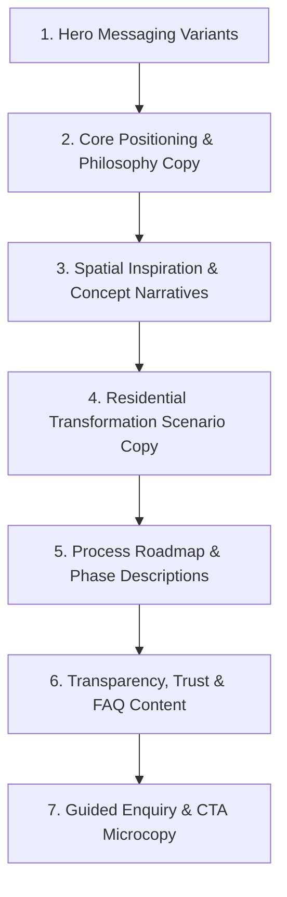

# Design Haven — Homepage Content Architecture

## Document Metadata
- **Project Name:** Design Haven
- **Repository:** FUTURE_PE_01
- **Document Type:** Homepage Content Architecture Specification
- **Phase:** Phase 4 — Content Architecture
- **Status:** Draft / Pending Project Owner Review
- **Last Updated:** 2026-08-19
- **Source Methodologies:** 
  - `prompts/01_BUSINESS_CONTEXT.md`
  - `prompts/02_BRAND_AND_AUDIENCE.md`
  - `prompts/03_CONTENT_GENERATION.md`
  - `prompts/04_CONTENT_EVALUATION.md`
  - `prompts/05_CONTENT_REFINEMENT.md`
  - `docs/PRD.md`
  - `docs/APP_FLOW.md`
  - `docs/UI_UX_DESIGN_BRIEF.md`

---

# 1. Homepage Purpose

The Design Haven homepage is conceived as an atmospheric, inspiration-first digital sanctuary rather than a transactional corporate portal. Its primary strategic purpose is to establish an immediate conceptual bridge for creative homeowners—guiding them from initial spatial curiosity to structured project inquiry without friction, confusion, or aggressive conversion pressure.

Specifically, the homepage must:
1. **Introduce Design Haven:** Clearly communicate Design Haven’s core philosophy—viewing interior space transformation as an authentic expression of personal identity, lifestyle, and long-term vision rather than superficial decoration or off-the-shelf catalog shopping.
2. **Create Curiosity:** Capture visitor interest upon arrival through evocative spatial storytelling and atmospheric visual framing that elevates the concept of living environment design.
3. **Provide Interior Design Inspiration:** Expose visitors to curated visual showcase concepts, material direction, and spatial compositions that spark creative ideas.
4. **Encourage Exploration:** Facilitate unrestricted, self-directed browsing across space categories, property transformation contexts, and design philosophies.
5. **Help Visitors Imagine Possibilities for Their Own Spaces:** Enable visitors across distinct home scenarios (existing home refresh, older property renovation, new construction, raw idea refinement) to connect Design Haven’s capabilities to their personal residential reality.
6. **Build Enough Confidence to Take Action:** Provide complete transparency regarding collaborative workflows, spatial planning methodologies, and non-presumptuous design guidance so genuinely interested visitors feel comfortable initiating a project dialogue.

> [!IMPORTANT]
> **Anti-Hallucination & Scope Constraint:** The homepage purpose must rely strictly on documented philosophy and user empowerment. It must not invent company history, founding dates, awards, completed project counts, team member metrics, client testimonials, physical addresses, specific pricing figures, or legally binding guarantees.

---

# 2. Core Visitor Types

To ensure messaging accuracy, the homepage content architecture caters strictly to the five established audience categories documented in the project baseline context:

### 1. Creative Homeowners
* **Audience Context:** Individuals residing in an existing home who desire a unique, elevated aesthetic aligned with their evolving lifestyle and personal identity.
* **Homepage Needs:** Need content that helps organize disparate aesthetic ideas into a unified, high-end visual concept without overriding their personal taste.
* **Context vs. Hypothesis:**
  * *Established Fact:* Creative homeowners value aesthetic individuality and view their home as an extension of identity.
  * *Reasonable Hypothesis:* They suffer from decision fatigue when attempting to select materials or coordinate layout elements independently.

### 2. People Transforming Existing Homes
* **Audience Context:** Homeowners looking to refresh, optimize, or reconfigure currently inhabited living environments without major structural demolition.
* **Homepage Needs:** Require content demonstrating how spatial layout adjustments, lighting design, and material curation can dramatically enhance daily living flow.
* **Context vs. Hypothesis:**
  * *Established Fact:* Focus is on holistic space transformation tailored to long-term living needs rather than cosmetic decor.
  * *Reasonable Hypothesis:* They worry about disrupting their daily household routines during the design and execution phases.

### 3. People Renovating or Reinventing Older Homes
* **Audience Context:** Owners of aging properties requiring partial or comprehensive spatial transformation while preserving structural integrity and character.
* **Homepage Needs:** Seek reassurance that modern spatial functionality can be integrated harmoniously with existing architectural character and structural constraints.
* **Context vs. Hypothesis:**
  * *Established Fact:* Require professional guidance on modernizing older structures while respecting architectural integrity.
  * *Reasonable Hypothesis:* They fear hidden structural complications, costly unforeseen revisions, or losing original charm.

### 4. People with Homes Under Construction
* **Audience Context:** Individuals currently constructing a residence or planning a new architectural build from bare structure to final interior layout.
* **Homepage Needs:** Need comprehensive end-to-end spatial planning guidance—moving from empty framing and room allocations to cohesive interior finishes.
* **Context vs. Hypothesis:**
  * *Established Fact:* Require foundational space planning, room-by-room flow, and integrated material selection early in the build cycle.
  * *Reasonable Hypothesis:* They are overwhelmed by the volume of simultaneous architectural decisions required before move-in.

### 5. People with Ideas Who Need Help Shaping or Refining an Interior Vision
* **Audience Context:** Idea-rich visitors who possess preliminary concepts (mood boards, saved imagery, fragmented style ideas) but lack the technical or architectural frameworks to execute them.
* **Homepage Needs:** Seek a collaborative design partner who will validate and elevate their raw ideas rather than impose a rigid, cookie-cutter portfolio style.
* **Context vs. Hypothesis:**
  * *Established Fact:* Require vision refinement frameworks and a collaborative, non-presumptuous design partner.
  * *Reasonable Hypothesis:* They fear traditional interior designers will dismiss their saved inspirations or force expensive off-the-shelf products.

---

# 3. Homepage Narrative Flow

The homepage architecture maps the visitor journey into eight sequential content blocks designed around the established 6-stage emotional framework:

$$\text{Curiosity} \longrightarrow \text{Inspiration} \longrightarrow \text{Exploration} \longrightarrow \text{Possibility} \longrightarrow \text{Confidence} \longrightarrow \text{Action}$$

The table below outlines the strategic progression for each stage of the homepage narrative:

| Journey Stage | Visitor Mindset | Content Objective | Information Required | Desired Emotional Direction | Appropriate Content Type | Possible Next Action |
| :--- | :--- | :--- | :--- | :--- | :--- | :--- |
| **Curiosity** | Cautious, exploratory, seeking visual quality and brand orientation. | Introduce Design Haven's philosophy and capture aesthetic attention instantly. | Atmospheric identity statement, value proposition, core spatial philosophy. | Intrigued, calm, visually inspired. | Atmospheric Hero framing, spatial value statement. | "Explore Inspiration" |
| **Inspiration** | Inspired by visual showcases; seeking spatial possibilities and style ideas. | Expose visitors to curated design showcases, light play, and material concepts. | Visual showcase categories, design directions, spatial mood narratives. | Creative, imaginative, visually stimulated. | Curated spatial preview showcase, design style cards. | "View Spatial Concepts" |
| **Exploration** | Evaluating how Design Haven approaches spatial discovery and style definition. | Provide interactive/visual self-discovery mechanisms to explore personal taste. | Style discovery frameworks, room category breakdowns, design mood parameters. | Engaged, self-aware, curious. | Interactive style teaser / mood matrix preview. | "Explore Your Style" |
| **Possibility** | Assessing fit for their specific home condition (existing, old, new build). | Demonstrate applicability across distinct residential transformation contexts. | Property context scenarios (Refresh, Renovation, Bare Structure, Vision Refinement). | Reassured, validated, hopeful. | Contextual transformation matrix, spatial scenario cards. | "See Transformation Options" |
| **Possibility → Confidence** | Seeking to understand how raw ideas transition into completed spatial plans. | Demystify the collaborative workflow from concept to realization. | 4-Phase process roadmap (Inspiration → Concept → Refinement → Realization). | Grounded, informed, structured. | Step-by-step visual process roadmap. | "Understand Our Process" |
| **Confidence** | Cautious about costs, losing creative control, or pushy sales tactics. | Establish complete operational transparency, anti-friction guarantees, and trust. | Collaborative philosophy breakdown, anti-pressure commitment, FAQ insights. | Confident, safe, respected. | Philosophy & transparency content cards, FAQ teasers. | "Read Common Questions" |
| **Action** | Motivated to shape their project vision and initiate a professional dialogue. | Provide a natural, low-friction entry into the guided project enquiry system. | Clear purpose of enquiry, required input fields preview, next-step reassurance. | Empowered, decisive, ready. | Guided enquiry conversion trigger, project questionnaire portal. | "Start Vision Inquiry" |

---

# 4. Proposed Content Architecture

The proposed homepage sequence consists of 8 distinct content blocks. Visual layouts, grid structures, fonts, and color palettes are deliberately excluded to preserve full creative authority for the project owner.

---

## Block 1: Hero Experience Block
### Purpose
Establish immediate atmospheric orientation, introduce Design Haven's core philosophy, and invite visitors into the experience without forcing immediate conversion.
### User Journey Stage
Curiosity
### Visitor Need Addressed
Need for immediate clarity on what Design Haven is and whether its aesthetic quality aligns with their personal expectations.
### Content Objective
Communicate that space transformation is an expression of personal identity and invite low-pressure exploration.
### Required Information
Core value statement, spatial philosophy headline, primary exploratory call-to-action.
### Possible Content Elements
- Atmospheric headline emphasizing spatial identity over decoration
- Supporting subheadline articulating the inspiration-to-realization bridge
- Primary exploration action trigger
- Secondary directional action trigger
### Possible CTA Direction
Primary: "Explore Inspiration" | Secondary: "Our Approach"
### Dependencies or Missing Information
Requires final approved messaging copy options; relies on verified core philosophy.

---

## Block 2: Brand Philosophy & Differentiator Block
### Purpose
Articulate Design Haven’s unique positioning—contrasting holistic spatial identity against superficial decor purchasing and high-pressure design sales.
### User Journey Stage
Curiosity → Inspiration
### Visitor Need Addressed
Desire to understand why Design Haven is different from off-the-shelf furniture platforms or rigid traditional design agencies.
### Content Objective
Shift visitor perception from buying decorative items to engaging in a collaborative spatial transformation journey.
### Required Information
Philosophy statement, core differentiator points (identity, collaboration, holistic environment design).
### Possible Content Elements
- Narrative title regarding space as identity
- 3 core philosophy pillars:
  1. *Authentic Identity:* Designing spaces around lived experience, not fleeting trends.
  2. *Collaborative Validation:* Elevating homeowner taste rather than dictating rigid styles.
  3. *Holistic Environments:* Balancing architectural light, material texture, and functional flow.
### Possible CTA Direction
"Discover Our Approach"
### Dependencies or Missing Information
Safe placeholder strategy required to ensure no fabricated company legacy or team size claims are introduced.

---

## Block 3: Curated Inspiration Showcase Block
### Purpose
Provide immediate visual and conceptual proof of Design Haven’s spatial design aesthetic across various living environments.
### User Journey Stage
Inspiration
### Visitor Need Addressed
Visitor need for visual inspiration, room ideas, light/material harmony, and conceptual clarity.
### Content Objective
Spark creative imagination by demonstrating how materials, lighting, and spatial layouts coalesce into cohesive spaces.
### Required Information
Showcase category tags (Living, Dining, Kitchen, Suite), spatial concept narratives, design style classifications.
### Possible Content Elements
- Section header framing spatial showcases as design directions
- Filterable/browseable concept cards featuring spatial themes (e.g., Warm Minimalist Living, Organic Contemporary Kitchen, Restorative Primary Suite)
- Short concept narratives focusing on light, texture, and flow (40–60 words)
- Contextual link to full inspiration gallery
### Possible CTA Direction
"Explore Full Inspiration Gallery" or "View Concept Details"
### Dependencies or Missing Information
Specific visual concept names and curated spatial themes must be finalized. No fake client names, addresses, or project budgets may be attached to showcases.

---

## Block 4: Interactive Style & Vision Explorer Teaser Block
### Purpose
Engage visitors in active self-discovery, helping them articulate their aesthetic preferences and spatial priorities.
### User Journey Stage
Inspiration → Exploration
### Visitor Need Addressed
Visitor struggle to articulate their vague style ideas into defined architectural and visual directions.
### Content Objective
Provide a low-friction taste of the style discovery framework, demonstrating how Design Haven helps structure raw concepts.
### Required Information
Style assessment parameters, mood classifications, spatial preference categories.
### Possible Content Elements
- Engaging header encouraging visual self-expression
- Teaser grid of aesthetic moods (e.g., Tactile & Warm, Sculptural & Clean, Architectural & Raw)
- Explanatory copy on how interactive preference selection shapes final design blueprints
### Possible CTA Direction
"Explore Your Style Direction"
### Dependencies or Missing Information
Requires functional specification of the Interactive Style Discovery tool from PRD Section 11.1.

---

## Block 5: Residential Transformation Context Matrix Block
### Purpose
Help visitors connect Design Haven’s capabilities directly to their personal home situation.
### User Journey Stage
Exploration → Possibility
### Visitor Need Addressed
Visitor question: *"Is Design Haven right for my specific project situation (renovation, bare construction, or existing home refresh)?"*
### Content Objective
Demonstrate spatial transformation methodology across all four established property contexts.
### Required Information
Four property scenario definitions:
1. *Existing Home Refresh:* Aesthetic and layout optimization for lived-in spaces.
2. *Older Property Renovation:* Modern spatial planning respecting structural integrity.
3. *New Build Bare Structure:* End-to-end interior layout from frame to finish.
4. *Vision Refinement:* Transforming saved ideas into architecturally feasible plans.
### Possible Content Elements
- Scenario-based content cards detailing typical challenges and Design Haven's spatial solutions for each home context
- Succinct narrative highlighting collaborative feasibility and spatial potential
### Possible CTA Direction
"Find Your Project Context" or "See Renovation Approaches"
### Dependencies or Missing Information
Ensuring scenario descriptions remain grounded in methodology without claiming fake project case studies or fabricated statistics.

---

## Block 6: Collaborative Design Process Roadmap Block
### Purpose
Demystify how a project moves from initial ideas to final interior execution, removing anxiety about the unknown.
### User Journey Stage
Possibility → Confidence
### Visitor Need Addressed
Visitor fear of complex, disorganized design projects, hidden steps, or loss of project momentum.
### Content Objective
Present a clear, step-by-step roadmap explaining the 4-phase transformation framework.
### Required Information
4-Step Process Breakdown:
1. *Inspiration & Discovery:* Sharing ideas, exploring style preferences, defining spatial goals.
2. *Concept Blueprinting:* Developing spatial layouts, lighting schemes, and material palettes.
3. *Design Refinement:* Polishing spatial details, selecting finishes, finalizing architectural plans.
4. *Realization Guidance:* Translating refined designs into physical spatial reality.
### Possible Content Elements
- Sequential process step display (1 to 4)
- Concise description of client involvement and Design Haven guidance at each milestone
- Reassuring copy highlighting transparent checkpoints
### Possible CTA Direction
"Explore Our Full Workflow"
### Dependencies or Missing Information
Execution timeline numbers (e.g., "completed in 4 weeks") must NOT be fabricated as specific timelines depend on individual project scope.

---

## Block 7: Trust, Transparency & Anti-Friction Block
### Purpose
Reduce remaining user hesitation by addressing concerns regarding creative control, pressure-free consultation, and working relationships.
### User Journey Stage
Confidence
### Visitor Need Addressed
Visitor fear of being locked into aggressive sales, receiving rigid non-collaborative designs, or encountering hidden costs.
### Content Objective
Build high trust through explicit transparency commitments and empathetic design principles.
### Required Information
Anti-pressure commitments, collaboration philosophy, introductory FAQ teaser addressing common hesitations.
### Possible Content Elements
- Core Trust Commitments:
  - *Your Vision First:* We elevate your taste, never replace it.
  - *Zero Pressure:* Explore at your own pace; no aggressive sales scripts.
  - *Transparent Guidance:* Clear process expectations before any commitment.
- FAQ snippet resolving 3 top hesitations (e.g., "What if I already have saved ideas?", "Do I need architectural plans first?")
### Possible CTA Direction
"Read Full FAQs" or "Understand Our Philosophy"
### Dependencies or Missing Information
Must not promise unverified pricing structures, instant price guarantees, or specific contractor networks.

---

## Block 8: Guided Project Enquiry Gateway Block
### Purpose
Provide a smooth, natural transition into the structured project enquiry flow for visitors who are ready to take action.
### User Journey Stage
Confidence → Action
### Visitor Need Addressed
Visitor ready to share their home context and shape a real project vision with professional guidance.
### Content Objective
Motivate qualified visitors to initiate a guided inquiry without feeling intimidated by complex corporate forms.
### Required Information
Purpose of enquiry, preview of simple multi-step questions (Property Status, Room Scope, Vision Notes), privacy and next-step reassurance.
### Possible Content Elements
- Welcoming, non-presumptuous call-to-action headline
- Brief overview of what the guided inquiry involves (a thoughtful 3-step questionnaire to capture your home context)
- Clear statement on what happens after submission (thoughtful review and a structured follow-up conversation)
- Direct action button launching the Guided Project Enquiry form
### Possible CTA Direction
Primary: "Begin Your Project Vision" or "Start Vision Inquiry"
### Dependencies or Missing Information
Specific follow-up response timeframe (e.g., "within 24 hours") must be framed safely unless operationally confirmed by the project owner.

---

# 5. Hero Content Role

The Hero section is the critical first impression for visitors arriving at Design Haven. It must perform a specific strategic role without resorting to transactional sales tactics.

### Core Communication Objective
Instantly communicate that Design Haven is a premier interior design sanctuary where creative homeowners transform living environments into authentic expressions of personal identity through professional collaboration.

### What the Visitor Should Understand
1. Design Haven focuses on space transformation, spatial flow, and identity-driven design.
2. The platform welcomes visitors with preliminary ideas and guides them toward refined realities.
3. The experience is inspiration-led, collaborative, and entirely free from aggressive sales tactics.

### What Emotion or Mindset Should Be Encouraged
- **Aesthetic Inspiration:** Feeling that home design is an exciting, creative endeavor.
- **Calm Reassurance:** Experiencing an unhurried, thoughtful digital environment.
- **Empowerment:** Realizing their personal taste and vision are valued and central to the process.

### What Should Be Avoided
- NO pushy transactional slogans ("Buy Now", "Claim Your Discount Today", "Limited Time Offer").
- NO generic AI marketing clichés ("Seamlessly blend elegance", "Tapestry of luxury", "Delve into design", "Game-changer").
- NO fabricated company metrics ("Over 500 homes transformed", "Award-winning studio", "20 years of experience").

### Action Directions
- **Primary Action Direction:** Directs visitors into visual discovery and spatial ideation (e.g., "Explore Inspiration").
- **Secondary Action Direction:** Directs cautious visitors to understand the collaborative methodology (e.g., "Our Approach").

---

### Conceptual Directions for the Hero

#### Conceptual Direction 1: Identity & Living Atmosphere
* **Core Concept:** Framing the home as the ultimate canvas of personal identity and daily atmosphere.
* **Content Focus:** Focuses on how thoughtful spatial design elevates daily living, light, and personal expression.
* **Tone:** Sophisticated, reflective, architectural.
* **Headline Concept:** *Spaces Shaped by Identity, Crafted for Living.*
* **Subheadline Concept:** *Transform your residential vision into a cohesive, distinctive interior through thoughtful spatial planning and collaborative design guidance.*
* **Primary Action:** "Explore Spatial Inspiration"
* **Secondary Action:** "Discover Our Approach"

#### Conceptual Direction 2: Bridging Vision to Reality
* **Core Concept:** Addressing the visitor who has creative ideas but needs professional expertise to structure and execute them.
* **Content Focus:** Focuses on the journey from raw mood boards and ideas to architecturally sound spatial realities.
* **Tone:** Encouraging, collaborative, empowering.
* **Headline Concept:** *From Initial Inspiration to Architectural Reality.*
* **Subheadline Concept:** *We partner with creative homeowners to refine, structure, and realize distinctive living environments tailored to your lifestyle.*
* **Primary Action:** "Explore Design Directions"
* **Secondary Action:** "How We Collaborate"

#### Conceptual Direction 3: Spatial Potential & Transformation
* **Core Concept:** Focusing on the latent potential within existing, aging, or newly framed residential structures.
* **Content Focus:** Emphasizes seeing beyond current walls and bare frames to unlock spatial flow and tactile material beauty.
* **Tone:** Visionary, inspiring, structured.
* **Headline Concept:** *Unlocking the True Potential of Your Living Space.*
* **Subheadline Concept:** *Whether reinventing an existing home, modernizing an older structure, or planning a new build, discover a refined path to spatial harmony.*
* **Primary Action:** "View Spatial Concepts"
* **Secondary Action:** "Find Your Home Context"

---

# 6. Inspiration and Exploration Content Role

Content in this section supports visitors who are still exploring possibilities and framing their initial aesthetic expectations.

### Strategic Role & Function
1. **Discovering Possibilities:** Provide visual and conceptual benchmarks that help users expand their imagination regarding spatial layouts, lighting integration, and material combinations.
2. **Thinking Differently About Existing Spaces:** Encourage visitors to look beyond superficial decoration—considering how spatial orientation, focal points, and room flow alter the daily experience of a home.
3. **Exploring Design Directions:** Present curated aesthetic moods (e.g., Warm Minimalist, Architectural Modern, Organic Contemporary) in concrete, tactile terms rather than abstract design jargon.
4. **Moving from Vague Ideas Toward Clearer Intent:** Provide structured categorization (by room type, structural condition, and aesthetic direction) so users can transition from casual image browsing to defining their preferred design attributes.

### Content Boundaries
- Focus strictly on spatial design rationale, light play, material textures, and functional flow.
- Do NOT invent completed client case studies, fabricated project budgets, or fake client testimonials.
- Showcase content as *Design Directions* and *Spatial Concepts* created to demonstrate Design Haven’s spatial philosophy.

---

# 7. Possibility and Transformation Content Role

Content in this section explicitly bridges Design Haven’s expertise with the visitor's personal property situation.

### Strategic Role & Function
Visitors evaluate websites by asking: *"Does this apply to my specific home situation?"* The content must explicitly address the core residential scenarios established in the PRD:

1. **Existing Homes:**
   - *Communication Objective:* Demonstrate how inhabited spaces can be reconfigured and refreshed to better align with evolving family dynamics, remote work needs, or elevated aesthetic preferences.
   - *Focus:* Spatial reconfiguration, lighting optimization, and material updates without unnecessary structural destruction.

2. **Older Homes & Historic Property Transformations:**
   - *Communication Objective:* Address the delicate balance between modernizing interior layouts and respecting structural character.
   - *Focus:* Improving spatial flow, integrating modern heating/lighting, and preserving authentic architectural elements.

3. **Homes Under Construction & New Builds:**
   - *Communication Objective:* Guide clients from bare framing and empty architectural plans to cohesive, warm interior spaces.
   - *Focus:* Foundational space planning, custom joinery integration, material palettes, and early room layout optimization.

4. **Raw Idea Refinement (Concept Collaborators):**
   - *Communication Objective:* Reassure visitors with saved images, mood boards, or magazine clippings that their initial ideas are a valuable foundation for professional refinement.
   - *Focus:* Structuring disparate inspirations into a harmonious architectural design blueprint.

### Content Boundaries
- Do NOT fabricate customer success stories, fake quotes, or unverified before-and-after timelines.
- Frame content through clear, scenario-based *Transformation Approaches* and *Spatial Feasibility Principles*.

---

# 8. Confidence-Building Content Role

Before taking action, cautious homeowners require reassurance to eliminate uncertainty and perceived risk.

### Required Reassurances (What Users Need to Understand)
- **Collaborative Authority:** Design Haven works *with* homeowners, elevating their personal style rather than dictating a rigid signature look.
- **Process Predictability:** Projects follow a structured, transparent 4-phase roadmap (Inspiration → Concept → Refinement → Realization).
- **Zero Pressure Environment:** Initial inquiries are exploratory conversations designed to clarify scope and feasibility without binding commitments.
- **Scope Clarity:** Clear understanding of what services are offered (spatial layout, material curation, concept blueprints) and what is out of scope (direct retail e-commerce, instant automated checkout).

### Missing Information & Verification Requirements
The following operational details must NOT be claimed on the homepage without explicit business verification from the project owner:

| Information Area | Status | Guardrail / Rule |
| :--- | :--- | :--- |
| **Specific Fee Structures & Package Costs** | Missing Business Info | Must NOT state dollar figures, hourly rates, or package costs. Use safe placeholder framing: *"Tailored project proposals based on custom spatial scope."* |
| **Turnaround Times & Project Schedules** | Missing Business Info | Must NOT guarantee delivery weeks or construction completion dates. Use safe placeholder framing: *"Structured milestones aligned with your project timeline."* |
| **Physical Address & Team Headcount** | Missing Business Info | Must NOT list fake street addresses, studio branches, or staff counts. Focus on digital accessibility and collaborative approach. |
| **Contractor & Licensing Guarantees** | Missing Business Info | Must NOT claim official builder licensing badges or contractor guarantees unless formally documented. |

---

# 9. Action and Enquiry Role

The homepage must naturally guide interested visitors toward initiating a project dialogue without creating friction or drop-off.

### Communication Objective
Position the Guided Project Enquiry not as a demanding sales form, but as a thoughtful, collaborative tool that helps visitors structure their own project requirements while sharing their vision with Design Haven.

### Key Messaging Principles
- **Low Pressure:** Emphasize that submitting an enquiry is an invitation to explore spatial possibilities and receive professional feedback.
- **Expectation Setting:** Clearly explain what information will be asked (property type, room scope, aesthetic preferences, project goals) and what happens next.
- **Privacy & Respect:** Reassure visitors that their personal information and property details are handled with complete confidentiality.

### Hard Prohibitions (What Must NOT Be Invented)
- Do NOT invent specific response windows (e.g., "We will call you within 15 minutes!").
- Do NOT promise free physical samples, free on-site site visits, or instant binding price quotes upon submission.
- Do NOT include fake phone numbers, direct personal email addresses, or unverified contact forms.
- Do NOT invent formal warranties or legally binding promises.

### Primary Conversion Trigger Direction
- **Headline Direction:** *Ready to Shape Your Living Space?*
- **Subheadline Direction:** *Share your property details, aesthetic preferences, and vision. We will review your context and help outline a tailored spatial path forward.*
- **Action Button Text:** "Begin Your Project Vision" or "Start Guided Inquiry"

---

# 10. Content Dependency Map

This map audits each proposed content block against current verified information in `01_BUSINESS_CONTEXT.md` and `PRD.md`, identifying safe placeholder strategies where business details remain pending.

| Content Block | Required Information | Currently Available? | Missing Information | Safe Placeholder Strategy |
| :--- | :--- | :--- | :--- | :--- |
| **1. Hero Experience** | Core positioning, primary & secondary CTA goals. | **YES** | Final approved headline copy variant. | Use concept directions from Section 5 grounded in verified philosophy. |
| **2. Brand Philosophy & Differentiators** | Value proposition, scope boundaries, core philosophy. | **YES** | Specific founding history or studio background story. | Focus purely on spatial identity philosophy and collaborative methodology. |
| **3. Curated Inspiration Showcase** | Category tags, design styles, spatial narrative descriptions. | **PARTIAL** | Specific finalized visual asset names and image files. | Structure around generic concept directions (e.g., Warm Minimalist Living) with conceptual narrative copy. |
| **4. Style & Vision Explorer Teaser** | Interactive assessment parameters and mood categories. | **PARTIAL** | Complete UI functional spec for the assessment tool. | Describe conceptual mood categories (Tactile, Sculptural, Architectural) conceptually. |
| **5. Transformation Context Matrix** | 4 Property transformation scenarios (Refresh, Old Home, New Build, Vision). | **YES** | Real-world client case study statistics or budgets. | Present as spatial methodology scenarios based on PRD Section 6 user categories. |
| **6. Collaborative Process Roadmap** | 4-Phase project roadmap steps. | **YES** | Specific calendar duration for each phase. | Describe phase objectives and collaborative activities without claiming fixed week counts. |
| **7. Trust, Transparency & Anti-Friction** | Anti-pressure principles, operational boundaries, FAQ topics. | **PARTIAL** | Specific pricing models, office address, phone contact. | Focus on collaboration principles, scope transparency, and general workflow FAQs. |
| **8. Guided Enquiry Gateway** | Form step structure, required fields, post-submission process. | **YES** | Exact follow-up SLA timeframe (e.g., 24h vs 48h). | State that inquiries receive a *"thoughtful project review and structured follow-up proposal."* |

---

# 11. Assumptions and Open Decisions

To maintain strict compliance with project governance and anti-hallucination rules, all information is categorized into four distinct buckets:

## Established Facts
*Verified details documented in source files (`01_BUSINESS_CONTEXT.md`, `PRD.md`, `TRD.md`, `APP_FLOW.md`):*
1. Design Haven is an inspiration-first interior design web platform for creative homeowners.
2. Core Philosophy: Space transformation is an authentic expression of personal identity, lifestyle, and long-term vision—not superficial decoration or e-commerce shopping.
3. Target Audiences: Creative Homeowners, Renovation Seekers, New Construction Owners, Concept Collaborators.
4. User Journey Stages: Curiosity → Inspiration → Exploration → Possibility → Confidence → Action.
5. Explicit Out-of-Scope Features: Direct e-commerce shopping cart, instant payment checkout, real-time 3D CAD rendering engine, client contractor tracking portal, native mobile apps.
6. Guided Project Enquiry gathers personal contact details, property status, room scope, and aesthetic preferences.

## Reasonable Hypotheses
*Analytical inferences based on user psychology and market context, requiring validation:*
1. Visitors who have saved Pinterest boards or Instagram screenshots fear that professional designers will dismiss their personal ideas.
2. Homeowners under construction experience decision fatigue and need early spatial layout guidance before final framing is locked.
3. Cautious homeowners are more likely to convert if they are reassured that design consultations are collaborative rather than dictatorial.
4. Providing a visual style discovery teaser increases engagement depth before introducing the project enquiry form.

## Information Still Required
*Pending operational details from the project owner before final copy publication:*
1. Official business contact methods (e.g., dedicated support email address or web form handling backend).
2. Expected inquiry follow-up timeline (e.g., 24 hours vs 2 business days).
3. Final decision on whether specific service packages or pricing guidance ranges will be disclosed prior to consultation.
4. Specific names or curated visual themes for initial gallery showcase assets.

## UI/UX Decisions Reserved for Project Owner
*Visual design and frontend implementation choices under the sole authority of the project owner:*
1. Selection of color palettes, light/dark themes, CSS variables, and visual contrast levels.
2. Typography selection, font pairings, heading scales, and line heights.
3. Layout structures, section grid patterns (e.g., Bento, Editorial, Split Grid), margin gaps, and whitespace allocation.
4. Hero layout selection (e.g., Hero07 reference model vs alternative layout patterns).
5. Animation choices, micro-interactions, transition speeds, and motion libraries.
6. Component implementations, UI library selections (React Bits, KokonutUI, etc.), and custom frontend code.

---

# 12. Recommended Content Generation Sequence

Following this homepage content architecture, actual copy assets should be generated in the following strategic order to ensure logical narrative progression and alignment:

1. **Hero Messaging Variants (`prompts/03_CONTENT_GENERATION.md` Template 1):**  
   *Reasoning:* Establishes the foundational tone, headline hierarchy, and core value proposition that all subsequent section copy must harmonize with.
2. **Core Positioning & Brand Philosophy Copy (`prompts/03_CONTENT_GENERATION.md` Template 3):**  
   *Reasoning:* Articulates the "space as identity" philosophy early, setting the collaborative, anti-decoration mindset.
3. **Spatial Inspiration & Concept Narratives (`prompts/03_CONTENT_GENERATION.md` Template 2):**  
   *Reasoning:* Generates tactile, light-and-material focused room stories that prove the visual quality of the platform.
4. **Residential Transformation Scenario Copy (`prompts/03_CONTENT_GENERATION.md` Template 3):**  
   *Reasoning:* Crafts clear explanations for the 4 property contexts (Existing, Old Home, New Build, Raw Ideas), establishing personal relevance for diverse visitors.
5. **Process Roadmap & Phase Descriptions (`prompts/03_CONTENT_GENERATION.md` Template 3):**  
   *Reasoning:* Outlines the 4-step collaborative journey (Inspiration → Concept → Refinement → Realization) to demystify the working model.
6. **Transparency, Trust & FAQ Content (`prompts/03_CONTENT_GENERATION.md` Template 6):**  
   *Reasoning:* Addresses common user hesitations, anti-pressure commitments, and practical working questions to build complete confidence.
7. **Guided Enquiry & CTA Microcopy (`prompts/03_CONTENT_GENERATION.md` Templates 4 & 5):**  
   *Reasoning:* Finalizes the form headers, field helpers, conversion triggers, and post-submission confirmation copy that guide visitors into action.

---

# 13. Final Readiness Summary

### Content Architecture Statistics & Coverage
- **Total Proposed Content Blocks:** 8 blocks
- **User Journey Coverage:** 100% complete coverage across all 6 emotional stages (*Curiosity → Inspiration → Exploration → Possibility → Confidence → Action*).
- **Target Audience Alignment:** Direct coverage for all 5 established visitor categories (Creative Homeowners, Existing Refresh, Old Home Renovation, New Build Construction, Idea Refinement).

### Critical Anti-Hallucination & Scope Verification
- **Fabricated Claims Included:** 0
- **Unverified Metrics / Awards / Testimonials:** 0
- **Out-of-Scope Features Introduced:** 0 (Zero e-commerce, zero instant checkout, zero 3D CAD engine).

### Conceptual Content Evaluation Pre-Flight Audit
Prior to finalizing this document, the proposed content architecture was audited conceptually against the 12-point Content Evaluation methodology in `prompts/04_CONTENT_EVALUATION.md`:
1. **Context Alignment:** PASS — Grounded 100% in `01_BUSINESS_CONTEXT.md` and `PRD.md`.
2. **Audience Alignment:** PASS — Directly addresses homeowner mindsets, cautious emotional states, and visual needs.
3. **User Journey Continuity:** PASS — Smooth progression without sudden conversion leaps or premature hard sells.
4. **Unsupported Assumptions:** PASS — Explicitly separated into Established Facts vs Reasonable Hypotheses in Section 11.
5. **Conversion Pressure:** PASS — Zero forced pop-ups; CTAs are progressive and contextual.
6. **Missing Information Handling:** PASS — Safe placeholder strategies defined for all unconfirmed business details in Section 10.

### Recommended Next Action
Proceed to **Phase 4 Task 2: Generation of Hero Messaging Copy Variants** using `prompts/03_CONTENT_GENERATION.md` Template 1, applying the three conceptual hero directions defined in Section 5 of this document.
