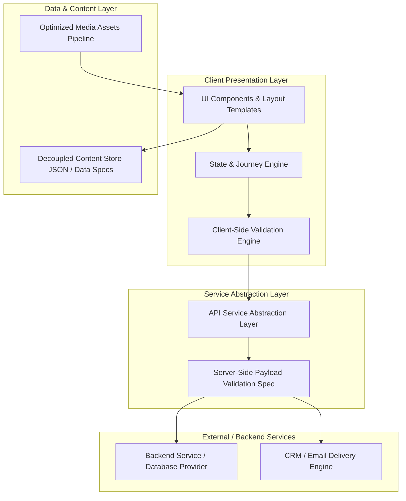
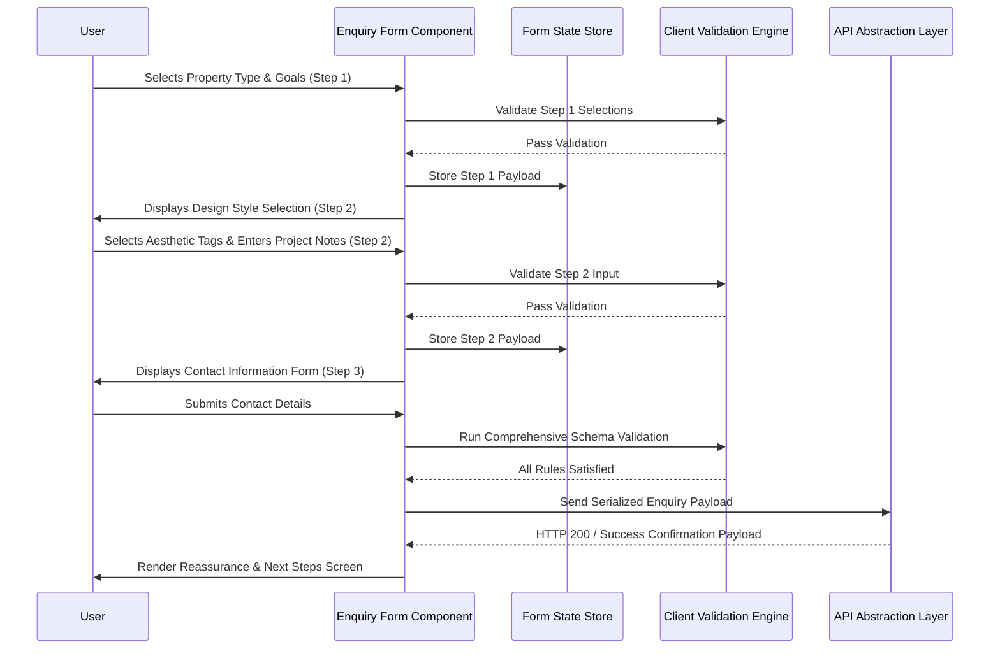

# Technical Requirements Document (TRD)

## 1. Document Information

| Attribute | Details |
| :--- | :--- |
| **Project Name** | Design Haven |
| **Repository** | FUTURE_PE_01 |
| **Document Type** | Technical Requirements Document (TRD) |
| **Status** | Approved / Baseline Technical Specification |
| **Version** | 1.0.0 |
| **Last Updated** | 2026-08-19 |
| **Primary Reference** | [PRD.md](file:///e:/career/GYM/docs/PRD.md) |
| **Target Audience** | Technical Lead, Frontend Engineers, System Architects, QA Engineers |

---

## 2. Technical Overview

This Technical Requirements Document (TRD) translates the product requirements specified in [PRD.md](file:///e:/career/GYM/docs/PRD.md) into concrete, engineering-ready technical specifications for **Design Haven**. 

Design Haven is an inspirational interior design web application focused on high-intent lead conversion for creative homeowners. The primary purpose of this TRD is to define system boundaries, data contracts, component architecture, quality validation pipelines, and engineering standards without enforcing rigid visual designs, specific UI frameworks, or vendor lock-in.

### System Boundaries
* **Client Layer:** High-performance, responsive web application executing on modern browser clients.
* **Content Layer:** Decoupled content architecture managing visual showcase metadata, spatial case studies, and editorial text.
* **Service/Validation Layer:** Client-side input validation engine with extensible server-side API validation interfaces.
* **Integration Layer:** Secure abstraction for transmitting qualified project enquiries to backend persistence services or CRM engines.

---

## 3. System Objectives

The system engineering design is governed by the following core technical objectives:

1. **Modular Frontend Architecture:** Implement a modern, component-based frontend architecture supporting strong separation of concerns, high code reusability, and maintainable component state.
2. **Decoupled Content Management:** Maintain all editorial text, category taxonomies, and visual gallery metadata separately from component logic to prevent duplicate code and enable effortless updates.
3. **Responsive & Adaptive Execution:** Deliver fluid layout adaptation across all viewport sizes (mobile, tablet, desktop, ultra-wide) while maintaining optimal touch targets and layout stability.
4. **Frictionless Lead Conversion Engine:** Engineer a robust multi-step guided project enquiry system with instant client-side validation, state persistence across steps, and reliable submission handling.
5. **Security & Secret Isolation:** Enforce a strict policy where no API keys, private credentials, or secrets are exposed in client-side bundles or source code.
6. **Accessibility & SEO Fundamentals:** Enforce WCAG 2.1 Level AA accessibility standards (semantic HTML, keyboard focus management, ARIA metadata) and foundational technical SEO best practices.
7. **Strict Quality Assurance:** Establish automated verification gates for type safety, linting, production build compilation, responsive integrity, and functional form flows.

---

## 4. High-Level System Architecture

The Design Haven application follows a decoupled, layered presentation architecture. The framework choice remains open to any modern component-driven system (e.g., React, Vue, Svelte, or native Web Components).



### Layer Responsibilities

| Architectural Layer | Key Technical Responsibilities |
| :--- | :--- |
| **Presentation Layer** | Renders UI elements, handles responsive layouts, manages local user interaction state, and enforces accessibility patterns. |
| **Content Layer** | Stores structured editorial data, gallery taxonomies, process step definitions, and image asset references independently of UI markup. |
| **State & Validation Layer** | Tracks multi-step form progression, validates field inputs against schema rules, and manages form draft state. |
| **API & Integration Layer** | Abstract HTTP client handling enquiry submission payloads, network retry logic, error handling, and server-side integration interfaces. |

---

## 5. Frontend Requirements

### Architectural Standards
* **Component-Based Structure:** The codebase must be organized into modular, single-responsibility components with explicitly typed props and clear event boundaries.
* **Separation of Concerns:** UI layout markup, styling definitions, content data, and business logic (validation, data formatting) must be isolated into distinct files/modules.
* **Framework Agnosticism:** Core business logic, validation schemas, and content models must be implemented using standard TypeScript/JavaScript to allow seamless adaptation to any modern framework.

### Layout & Rendering Strategy
* **Modular Page Routing:** Logical route handling for core views: Landing Page, Inspiration Gallery, Philosophy & Process, and Guided Project Enquiry.
* **Render Optimization:** Components must prevent unnecessary re-renders when parent state updates occur, utilizing efficient state isolation.
* **Asset Loading Strategy:** Below-the-fold media assets (high-resolution space showcases) must utilize lazy loading and explicit dimensions to avoid cumulative layout shifts (CLS).

---

## 6. Component Architecture Requirements

### Component Taxonomy & Hierarchy

```
src/
├── components/
│   ├── primitives/         # Atomic UI controls (Buttons, Inputs, Badges, Modals)
│   ├── composite/          # Functional feature blocks (Gallery Cards, Step Roadmaps)
│   ├── layout/             # Structure containers (Header, Footer, Grid Containers)
│   └── views/              # Page-level containers (Home, Inspiration, Enquiry)
```

1. **Primitive UI Components:**
   * Generic, stateless components (e.g., `Button`, `TextField`, `SelectDropdown`, `Badge`, `ModalContainer`).
   * Highly reusable; accept explicit props for variant, size, state (disabled, active, error), and accessible ARIA attributes.

2. **Composite Feature Components:**
   * Context-aware components combining primitives (e.g., `GalleryFilterBar`, `ConceptCard`, `TransformationStepCard`, `EnquiryFormStep`).
   * Handle component-level event propagation (e.g., filter selection, form step navigation).

3. **Page View Components:**
   * Orchestrate composite components and bind data from the Content Layer.
   * Manage page-level metadata and top-level user journey tracking.

### Component Interfaces & Contracts
* Component props must be strictly defined via schemas or interfaces.
* Default fallback values must be declared for optional props.
* Direct DOM manipulation outside standard framework refs is strictly prohibited.

---

## 7. Content Architecture

To ensure content can be updated and localized without modifying component markup, all application copy and showcase data must reside in decoupled content models.

### Gallery Item Schema Interface
```typescript
export interface GalleryItem {
  id: string;
  title: string;
  category: 'living' | 'kitchen' | 'bedroom' | 'dining' | 'architectural';
  propertyType: 'renovation' | 'new_build' | 'transformation';
  styleTags: string[];
  thumbnailUrl: string;
  heroImageUrl: string;
  spatialDescription: string;
  transformationHighlights: string[];
}
```

### Process Step Schema Interface
```typescript
export interface ProcessStep {
  stepNumber: number;
  phaseName: string;
  userState: string;
  description: string;
  keyDeliverables: string[];
}
```

### Editorial & Copy Model Schema
```typescript
export interface CopyContentStore {
  hero: {
    headline: string;
    subheadline: string;
    primaryCtaText: string;
    secondaryCtaText: string;
  };
  philosophy: {
    title: string;
    bodyParagraphs: string[];
  };
  enquiryHeader: {
    title: string;
    subtitle: string;
  };
}
```

---

## 8. Prompt Engineering Workflow

All marketing, process descriptions, visual category descriptions, and microcopy generated via AI must follow a structured, reproducible engineering workflow prior to inclusion in the Content Architecture store.

### Workflow Pipeline

```
Business Context
       │
       ▼
Prompt Design
       │
       ▼
AI Content Generation
       │
       ▼
Content Evaluation
       │
       ▼
Content Refinement
       │
       ▼
Website Implementation
```

### Standardized Prompt Structure Specification

Every prompt used for content generation must contain the following 6 structural components:

| Prompt Component | Technical Purpose |
| :--- | :--- |
| **Role** | Defines the persona and domain expertise (e.g., "Senior Architectural Writer and UX Specialist"). |
| **Business Context** | Specifies Design Haven's mission, target creative homeowners, and inspiration-first positioning. |
| **Objective** | Declares the exact output expected (e.g., "Draft progressive disclosure copy for process step 3"). |
| **Target Audience** | Outlines demographic and cognitive mindset (cautious, aesthetic-focused, seeking collaborative expertise). |
| **Constraints** | Enforces voice boundaries, character limits, tone, and strict anti-hallucination rules. |
| **Required Output Format** | Specifies structured output (e.g., JSON schema, key-value key-set, markdown array). |

### Master Prompt Template Example
```markdown
[ROLE]: You are an architectural copywriter specializing in modern residential interior design.
[BUSINESS CONTEXT]: Design Haven helps creative homeowners transform their properties into personalized spaces through inspiration and low-pressure collaboration.
[OBJECTIVE]: Generate headline and body copy for the "Step-by-Step Transformation Process" card 2.
[TARGET AUDIENCE]: Homeowners seeking professional guidance for home renovation or under-construction projects.
[CONSTRAINTS]: 
- Tone must be empathetic, sophisticated, clear, and reassuring.
- Do NOT use pushy sales language ("Buy now", "Best offer").
- Do NOT invent awards, company years, or project stats.
[OUTPUT FORMAT]: JSON object with keys: "headline", "subheadline", "descriptionPoints" (array of 3 strings).
```

---

## 9. Prompt Quality and Hallucination-Control Requirements

AI-generated content used across Design Haven must strictly adhere to factual verification rules to maintain technical integrity and brand trust.

### Prohibited Hallucination Attributes
The AI content generation workflow **MUST NOT** synthesize, fabricate, or assume any of the following parameters unless explicitly provided and verified in source business documentation:

* Company founding history or background milestones
* Industry awards, rankings, or accolades
* Years of operating experience
* Total completed project counts or client volume metrics
* Client testimonials or named reviews
* Physical office addresses or geographic coordinates
* Formal industry certifications or accreditation badges
* Specific pricing tiers, discount packages, or cost estimates
* Performance guarantees or SLA timelines
* Direct telephone numbers or staff contact details

### Verification Protocol
1. **Automated Schema Audit:** Content payloads injected into the repository must be validated against JSON schemas that reject unauthorized metric fields.
2. **Editorial Verification Gate:** Every text string must undergo a manual audit before being committed to `docs/` or production content files.
3. **Fallback Content Policy:** Where specific business details are absent, copy must focus exclusively on spatial design philosophy, user methodology, and visual inspiration frameworks.

---

## 10. User Interaction Technical Requirements

### Journey Progression Tracking
* The client application must support the 6-stage user journey outlined in PRD Section 12:
  1. *Curiosity* → 2. *Inspiration* → 3. *Exploration* → 4. *Possibility* → 5. *Confidence* → 6. *Action*
* Journey progression state must be tracked client-side to ensure seamless navigation transitions between gallery filtering, philosophy deep-dives, and enquiry forms.

### Filter & Discovery Engine Mechanics
* **Multi-Faceted Client Filtering:** The Inspiration Gallery must execute real-time filter logic across multiple properties:
  * Category (Room type: Living, Kitchen, Bedroom, Architectural)
  * Property Condition (Renovation, New Build, Modernization)
  * Visual Style Tags
* **Filter State Persistence:** Filter states should reflect in URL search parameters (e.g., `?category=kitchen&condition=renovation`) to support direct deep-linking and browser navigation history (`pushState`/`replaceState`).

---

## 11. Project Enquiry Requirements

### Guided Vision Enquiry Architecture
The project enquiry system must be implemented as a stateful, multi-step guided questionnaire designed to minimize form fatigue and drop-off.



### Enquiry Payload Schema
```typescript
export interface ProjectEnquiryPayload {
  fullName: string;
  email: string;
  phone: string;
  propertyType: string;
  projectStage: string;
  location?: string;
  projectScope?: string;
  vision?: string;
}
```

---

## 12. Form Validation Requirements

### Dual-Layer Validation Model
Validation must occur on both the client (for instant UX feedback) and the server/backend API (to enforce data integrity and security).

```
[User Input] 
      │
      ▼
[Client-Side Validation] ──(Invalid)──> Render Contextual Inline Error State
      │
   (Valid)
      ▼
[API Payload Serialization]
      │
      ▼
[Server-Side Validation] ──(Invalid)──> Return HTTP 400 with Field Error Array
      │
   (Valid)
      ▼
[Database / CRM Persistence]
```

### Validation Rules Matrix

| Form Field | Mandatory | Client Validation Criteria | Error Message Trigger |
| :--- | :--- | :--- | :--- |
| **Full Name** | Yes | Minimum 2 characters, sanitize HTML/script tags. | "Please provide your name." |
| **Email Address** | Yes | Standard RFC 5322 email pattern check. | "Please provide a valid email address." |
| **Phone Number** | Yes | Valid telephone pattern, 7–20 characters. | "Please provide a valid phone number." |
| **Property Type** | Yes | Non-empty selection from property context options. | "Please select your current property context." |
| **Project Stage** | Yes | Non-empty selection from project stage options. | "Please select your project stage." |
| **Location** | No | Optional; max 150 characters. | "Location cannot exceed 150 characters." |
| **Project Scope** | No | Optional; max 200 characters. | "Project scope cannot exceed 200 characters." |
| **Vision / Notes** | No | Max 3000 characters; sanitize raw HTML strings. | "Vision cannot exceed 3000 characters." |

### Client & Server Validation Behavior
* **Client-Side:** Real-time feedback triggered on input blur or step submit. Input fields must be bound to `aria-invalid` and `aria-describedby` error identifiers.
* **Server-Side API Contract:** Backend endpoint must validate incoming JSON against JSON Schema / Zod definitions and return structured HTTP 400 response errors:
```json
{
  "status": "error",
  "message": "Validation failed",
  "errors": [
    { "field": "email", "code": "INVALID_EMAIL", "message": "Email address format is invalid." }
  ]
}
```

---

## 13. Responsive Technical Requirements

### Breakpoint Strategy
Layouts must adapt smoothly across four standard device breakpoint categories:

| Breakpoint Tier | Target Viewport Width | Layout Adaptations |
| :--- | :--- | :--- |
| **Mobile** | `< 768px` | Single column grid, stacked forms, mobile navigation drawer/menu, full-width touch buttons. |
| **Tablet** | `768px - 1023px` | Two-column gallery grid, side-by-side card items, persistent top bar navigation. |
| **Desktop** | `1024px - 1439px` | Multi-column grid systems, expanded inspiration filters, side-by-side process flow maps. |
| **Ultra-Wide** | `>= 1440px` | Centered max-width content container (e.g., max 1280px or 1440px), generous side whitespace. |

### Mobile Touch & Target Guidelines
* Minimum touch target dimensions: `44px x 44px` for all interactive elements (buttons, filter chips, navigation links).
* Eliminate horizontal scrollbars (`overflow-x: hidden` on viewport roots).
* Touch inputs (e.g., gallery swipes or selection cards) must prevent input lag and touch delay.

---

## 14. Accessibility Requirements

Design Haven must adhere to **WCAG 2.1 Level AA** compliance standards across all technical views.

### Technical Accessibility Standards

1. **Semantic HTML Structure:**
   * Use structural landmark elements: `<header>`, `<nav>`, `<main>`, `<section>`, `<article>`, `<footer>`.
   * Form fields must be wrapped in `<form>` containers using proper `<label for="...">` associations or ARIA labeling.
   * Headings must follow strict hierarchy (`<h1>` down to `<h6>`) without skipping levels.

2. **Keyboard Navigability & Focus Management:**
   * All interactive controls (buttons, links, form step controls, filter chips) must be operable via standard keyboard (`Tab`, `Shift+Tab`, `Enter`, `Space`).
   * Visible focus indicators (`:focus-visible`) must provide a clear outline around focused elements.
   * Multi-step form step changes must move focus to the top of the newly displayed step header.

3. **Screen Reader Accessibility (ARIA):**
   * Expandable components (menus, accordions, modals) must specify `aria-expanded` and `aria-controls`.
   * Dynamic content changes (validation message popups, filter updates) must use live regions (`aria-live="polite"` or `role="status"`).
   * Active steps in multi-step indicators must declare `aria-current="step"`.

4. **Visual Contrast & Media Alt Text:**
   * Text-to-background contrast ratio must satisfy a minimum of `4.5:1` for normal text and `3:1` for large text.
   * Every informative image must include a meaningful `alt` text attribute describing the spatial concept. Decorative graphics must declare `alt=""` or `aria-hidden="true"`.

---

## 15. Performance Requirements

### Core Web Vitals Targets
The technical implementation must target the following performance metrics:

| Metric | Full Name | Target Threshold |
| :--- | :--- | :--- |
| **LCP** | Largest Contentful Paint | `< 2.5 seconds` |
| **INP** | Interaction to Next Paint | `< 200 milliseconds` |
| **CLS** | Cumulative Layout Shift | `< 0.1` |
| **TTFB** | Time to First Byte | `< 600 milliseconds` |

### Asset & Media Optimization
* Image formats should prioritize modern compressed web formats (e.g., WebP or AVIF) with fallback PNG/JPEG options.
* Images must utilize `srcset` attributes to serve appropriately sized assets based on client device resolution.
* Explicit height and width CSS or HTML attributes must be declared for all visual components to reserve space during layout calculation.

### Dependency Management
* Avoid unnecessary third-party libraries; prefer vanilla browser APIs for UI interactions and state handling.
* Ensure all imported modules support tree-shaking to keep bundle sizes compact.

---

## 16. SEO Foundation

### Technical SEO Requirements
* **Unique Page Title Tags:** Every view must define a descriptive title tag (e.g., `Design Haven | Inspirational Interior Space Transformation`).
* **Meta Descriptions:** Provide unique, compelling meta descriptions for key routes summarizing product values.
* **Heading Hierarchy:** Strictly one `<h1>` per page view reflecting the core subject of the view.
* **Canonical URL Tags:** Include standard `<link rel="canonical" href="...">` elements to prevent duplicate content indexing issues.
* **Open Graph Metadata:** Implement standard social sharing meta tags:
  * `og:title`, `og:description`, `og:image`, `og:type`, `og:url`
  * `twitter:card`, `twitter:title`, `twitter:description`
* **Semantic Anchor Elements:** All navigation transitions must use valid `<a>` elements with readable `href` attributes rather than unlinked `<div>` click handlers.

---

## 17. Error Handling

### Client Exception Boundaries
* Enforce global error boundaries around major UI view sections to catch JavaScript execution exceptions and display a user-friendly fallback view without crashing the entire app.

### Network & Form Submission Failures
* Implement graceful retry logic for API interactions during enquiry form submission.
* If a network request fails, display a clear inline message (e.g., *"We were unable to transmit your enquiry. Please check your connection and try again."*) while preserving the user's filled form data in client state.

### Missing Data & Fallbacks
* Provide default empty states for gallery views when filter combinations yield zero results.
* Fallback visual placeholders must render gracefully if an image URL fails to load.

---

## 18. Security Considerations

### Secret Exposure Prevention
* **Strict Rule:** No API keys, backend database credentials, private tokens, or administrative secrets may be stored, embedded, or referenced within client-side code or publicly bundled files.
* Environment variables must separate public configurations (e.g., `PUBLIC_API_URL`) from secret server keys.

### XSS & Input Sanitization
* All user text inputs submitted through the enquiry form must be sanitized before processing or rendering to prevent Cross-Site Scripting (XSS).
* Raw HTML injection (`dangerouslySetInnerHTML` or equivalent) is strictly forbidden for user-supplied content.

### API Security Readiness
* Forms and API clients must support Content Security Policy (CSP) headers.
* Server communications must enforce HTTPS encryption.

---

## 19. Testing Requirements

Quality assurance for Design Haven requires multi-layered testing procedures prior to release:

### Testing Matrix

| Testing Tier | Scope & Tooling | Verification Criteria |
| :--- | :--- | :--- |
| **Type Checking** | Static Type Checker (e.g., TypeScript) | 100% type coverage for data schemas, component props, and API payloads; zero compilation type errors. |
| **Linting & Code Quality** | Linter & Formatter (e.g., ESLint, Stylelint) | Zero lint errors or syntax warnings; enforcement of consistent code formatting. |
| **Build Validation** | Bundler Build Pipeline | Successful creation of production build artifacts without compilation errors or missing dependencies. |
| **Responsive Verification** | Multi-Device Viewport Testing | Verified layout accuracy across Mobile (375px), Tablet (768px), Desktop (1024px+), and Ultra-wide screens. |
| **Functional Form Testing** | Interactive Form Progression Audit | Successful verification of validation error triggers, step navigation, state persistence, and submission payloads. |
| **Accessibility Audit** | Automated & Manual ARIA/Focus Checks | Zero critical accessibility violations reported by automated audit tools; verified keyboard navigability. |

---

## 20. Deployment Requirements

### Build & Delivery Model
* The frontend application must compile into static or server-rendered production-ready assets capable of hosting on any standard web application platform or CDN.

### Environment Configuration
* Configuration settings must be isolated using environment variable files:
  * `.env.development` - Local development configurations
  * `.env.production` - Production environment endpoints and public settings
* The build configuration must fail explicitly if required build-time variables are missing.

### Automated Continuous Integration (CI)
* Every pull request must automatically trigger a CI check executing:
  1. Type checking
  2. Code linting
  3. Production build test compilation

---

## 21. Future Scalability

While Phase 1 targets a streamlined inspiration and lead conversion site, the architecture must support seamless expansion:

* **Headless CMS Integration:** The decoupled content schemas (Section 7) allow replacing static JSON files with a Headless CMS endpoint (e.g., Contentful, Strapi, Sanity) without changing component markup.
* **CRM & Automation Pipelines:** The standardized enquiry payload (Section 11) is structured to connect directly to CRM platforms (HubSpot, Salesforce) or automated email notification services via backend webhooks.
* **Localization & Multi-Region Support:** Content models are keyed to support multi-language translation dictionaries as Design Haven expands into international markets.

---

## 22. Technical Success Criteria

The technical implementation of Design Haven will be judged successful when it meets all of the following empirical verification criteria:

| Success Metric | Target Threshold / Objective |
| :--- | :--- |
| **TRD Completeness** | All 22 required technical sections fully populated without TBD placeholders. |
| **PRD Alignment** | 100% functional traceability back to requirements defined in [`docs/PRD.md`](docs/PRD.md). |
| **Architecture Decoupling** | Component tree strictly separated from content models and API validation logic. |
| **Form Validation Integrity** | Dual-layer validation specification verified for all enquiry input fields with actionable error messaging. |
| **Anti-Hallucination Compliance** | Zero unverified company stats, awards, years, testimonials, or pricing metrics in content stores. |
| **Security Integrity** | Zero exposure of secret API keys or private credentials in client code. |
| **Accessibility Standard** | Compliance with WCAG 2.1 Level AA standards (semantic HTML, keyboard access, focus states, alt text). |
| **Responsive Stability** | Verified layout stability and target dimensions across mobile, tablet, and desktop viewports. |
