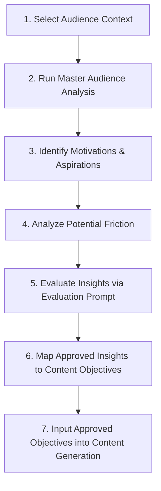

# Brand and Audience Understanding Prompts

## 1. Purpose

Effective content for **Design Haven** must begin with a deep understanding of the visitor's mindset rather than relying on generic assumptions about interior design customers. 

Visitors to Design Haven arrive at varying stages of visual curiosity, spatial planning, and decision-making readiness. To ensure content resonates meaningfully without resorting to aggressive sales tactics or generic decorative fluff, the prompts in this document facilitate systematic analysis of the visitor journey through the following analytical progression:

$$\text{User Mindset} \longrightarrow \text{Motivation} \longrightarrow \text{Aspirations} \longrightarrow \text{Uncertainty} \longrightarrow \text{Information Needs} \longrightarrow \text{Confidence} \longrightarrow \text{Action}$$

By examining how user mindsets transition into active project intent, these prompts ensure that all content strategies directly support Design Haven's core philosophy: **inspiring visitors first, building trust through spatial clarity, and enabling low-friction project inquiries.**

---

## 2. Audience Context

Design Haven targets individuals across four primary, project-defined audience categories. These categories reflect authentic residential contexts rather than speculative demographic assumptions (aligned with `01_BUSINESS_CONTEXT.md` and `PRD.md` Section 6):

### Creative Homeowners
People who already own a home and want to improve, transform, personalize, or rethink their living environment to better reflect their identity, lifestyle, and evolving needs.

### Renovation Seekers (Old Home Transformation)
People with older properties that require thoughtful renovation, spatial redesign, structural reinvention, or a fresh design direction while respecting the building's character.

### New Construction Owners (Homes Under Construction)
People whose homes are currently being built or planned, and who are thinking ahead about how their bare structures and future interior spaces should look, feel, and function.

### Concept Collaborators (Idea-Rich Visitors)
People who already possess abundant ideas, mood boards, inspiration photos, or personal preferences, but need professional guidance to organize, refine, and translate those scattered concepts into a cohesive, executable interior vision.

> [!IMPORTANT]
> **Demographic Boundary Guardrail:**  
> Do **NOT** invent or assume demographic details such as age ranges, income brackets, specific occupations, family structures, or geographic locations unless explicitly provided in verified project inputs. All audience analysis must focus strictly on psychological mindset, spatial scenarios, information needs, and decision-making friction.

---

## 3. Master Audience Analysis Prompt

Use this prompt to perform an end-to-end analysis of a specific Design Haven audience segment.

```markdown
### MASTER AUDIENCE ANALYSIS PROMPT

#### ROLE
You are a Lead User Researcher and Behavioral Strategist for Design Haven, an inspiration-first interior design web platform.

#### CONTEXT
Design Haven serves as an inspirational and instructional bridge for homeowners who have initial creative ideas but require professional expertise to refine and execute them. The platform operates on a zero-pressure model, guiding users through six emotional stages: Curiosity → Inspiration → Exploration → Possibility → Confidence → Action.

#### OBJECTIVE
Analyze a selected audience segment to uncover their mindset, motivations, frustrations, uncertainties, and decision-making needs, distinguishing between established project facts and reasonable analytical hypotheses.

#### INPUT
- **Audience Segment:** [Select one: Creative Homeowners | Renovation Seekers | New Construction Owners | Concept Collaborators]
- **Specific Context Details (if any):** [Insert any specific project notes, or write "Standard Project Context"]

#### ANALYSIS REQUIREMENTS
Analyze the selected segment across the following analytical dimensions:
1. **Current Situation:** The physical and spatial reality of the user's home or project.
2. **Existing Mindset:** Their emotional and cognitive state upon visiting Design Haven.
3. **Design Aspirations:** What they hope to achieve visually, functionally, and sensorially.
4. **Primary Motivations:** The underlying reasons driving their search for design inspiration or support.
5. **Frustrations:** Past pain points with traditional interior design platforms or services.
6. **Uncertainty:** Specific ambiguities, fears, or unknowns holding them back.
7. **Desired Outcomes:** The ideal spatial and emotional resolution they seek.
8. **Information Needs:** What knowledge, process breakdowns, or visual proof they need to see.
9. **Confidence Barriers:** Hesitations around budgets, timelines, designer authority, or decision-making.
10. **Exploration Drivers:** Triggers that encourage them to explore galleries, deep-dives, and process breakdowns.
11. **Project Intent Drivers:** Contextual touchpoints that encourage them to initiate a guided project enquiry.

#### OUTPUT FORMAT
Provide a structured Markdown breakdown using the following format:

### 1. Segment Overview
- **Analyzed Segment:** [Name]
- **Context Basis:** [Established Project Context]

### 2. Mindset & Psychological Profile
- **Current Situation:** [Description]
- **Existing Mindset:** [Description]
- **Design Aspirations:** [Description]

### 3. Motivations & Desired Outcomes
- **Core Motivations:** [Description]
- **Desired Outcomes:** [Description]

### 4. Frustrations, Uncertainties & Confidence Barriers
- **Frustrations & Pain Points:** [Description]
- **Uncertainty & Ambiguity:** [Description]
- **Confidence Barriers:** [Description]

### 5. Engagement & Intent Drivers
- **Exploration Triggers:** [Description]
- **Project Intent Triggers:** [Description]

### 6. Analytical Classification Table
| Insight Dimension | Established Project Facts | Reasonable Hypotheses / Suggestions |
| :--- | :--- | :--- |
| **User Mindset** | [Grounded in PRD/TRD/Flow] | [Inferred analytical hypothesis] |
| **Spatial Need** | [Grounded in PRD/TRD/Flow] | [Inferred analytical hypothesis] |
| **Decision Friction** | [Grounded in PRD/TRD/Flow] | [Inferred analytical hypothesis] |

#### CONSTRAINTS
- Do NOT invent customer demographics (age, income, location, family status).
- Do NOT present analytical hypotheses or suggestions as established project facts.
- Do NOT introduce unverified company claims, awards, pricing figures, or client testimonials.
```

---

## 4. User Motivation Analysis Prompt

Use this prompt to examine the multi-dimensional drivers behind a user's search for interior design guidance.

```markdown
### USER MOTIVATION ANALYSIS PROMPT

#### CONTEXT
Refer to the Design Haven business context (`prompts/01_BUSINESS_CONTEXT.md`). Users seek interior design guidance for diverse reasons, ranging from spatial functional needs to personal identity expression.

#### TASK
Analyze the potential motivation profile for a visitor in the following category: {TARGET_AUDIENCE_CATEGORY}.

#### ANALYTICAL MOTIVATION DIMENSIONS
Evaluate how the following potential dimensions apply to this audience (treat these as possible analytical lenses, not universal assumptions):
- Desire for spatial transformation
- Personal expression and identity representation
- Optimizing or rethinking space functionality
- Enhancing or preserving an existing living environment
- Forward-planning for a new build or upcoming construction phase
- Structuring scattered ideas into a unified design vision

#### REQUIRED OUTPUT
Provide a structured Markdown response detailing:

### 1. Primary Motivations
- [Core reasons driving the search]

### 2. Secondary Motivations
- [Supporting functional or practical objectives]

### 3. Emotional Drivers
- [Internal feelings, identity goals, and atmospheric desires]

### 4. Practical Drivers
- [Spatial layout, durability, architectural constraints, lifestyle needs]

### 5. Potential Friction
- [Fears of losing control, budget ambiguity, overwhelm from choices]

### 6. Confidence-Building Opportunities
- [How Design Haven's inspiration-first, transparent process alleviates friction]
```

---

## 5. Aspirations and Desired Outcome Prompt

Use this prompt to map how a user envisions moving from their current home situation to their ideal future state.

```markdown
### ASPIRATIONS AND DESIRED OUTCOME PROMPT

#### CONTEXT
Design Haven enables users to bridge the gap between initial ideas and complete spatial realities.

#### TASK
Analyze the transformation journey for: {AUDIENCE_SEGMENT_OR_SCENARIO}.

#### ANALYSIS REQUIREMENTS
1. Identify what the user may want their space to become (visual, spatial, functional evolution).
2. Detail the type of transformation they imagine (e.g., full layout overhaul, modernizing older architecture, bare-shell customization).
3. Determine emotional outcomes (e.g., tranquility, pride, harmony) and functional outcomes (e.g., flow, light utilization, storage).
4. Identify uncertainties that prevent them from taking action independently.

#### CONSTRAINTS
- Do NOT create fabricated customer testimonials or quoted claims.
- Keep all aspirations grounded in plausible spatial and psychological dynamics.

#### REQUIRED OUTPUT FORMAT
Present the analysis as a structured Markdown table:

| Current Situation | Possible Aspiration | Potential Barrier | Opportunity for Design Haven |
| :--- | :--- | :--- | :--- |
| [Current home state or challenge] | [Desired future space & atmosphere] | [Uncertainty or barrier holding them back] | [How Design Haven content/experience addresses this] |
```

---

## 6. Pain Point and Friction Analysis Prompt

Use this prompt to identify potential obstacles that could cause user drop-off or hesitation across the user journey.

```markdown
### PAIN POINT AND FRICTION ANALYSIS PROMPT

#### CONTEXT
Traditional interior design platforms often create friction through pushy sales forms, intrusive pop-ups, lack of pricing/process transparency, or overwhelming choice overload. Design Haven eliminates these friction points through a zero-pressure, inspiration-first approach.

#### TASK
Analyze potential decision-making friction for: {TARGET_AUDIENCE_CATEGORY} across all key user journey stages.

#### STAGES TO ANALYZE
- **Inspiration Stage:** Overwhelm by unstructured imagery; lack of clear aesthetic categorization.
- **Exploration Stage:** Difficulty finding relevant project types (renovation vs new build vs existing).
- **Understanding Possibilities Stage:** Uncertainty about how raw ideas translate into professional plans.
- **Decision-Making Stage:** Fear of losing personal style control to a rigid designer.
- **Trust Building Stage:** Lack of clear workflow transparency or fear of hidden costs.
- **Taking Action Stage:** Intimidating, complex, or high-pressure enquiry forms.

#### CONSTRAINTS
- Do NOT claim that identified friction points are empirically proven customer facts unless supported by explicitly provided research data. Treat them as analytical friction hypotheses.

#### REQUIRED OUTPUT FORMAT
Present the analysis in the following structured Markdown table:

| Journey Stage | Possible Friction | Why It Matters | Potential Response |
| :--- | :--- | :--- | :--- |
| **Inspiration** | [Potential friction point] | [Impact on user mindset/behavior] | [Design Haven UX/content solution] |
| **Exploration** | [Potential friction point] | [Impact on user mindset/behavior] | [Design Haven UX/content solution] |
| **Possibilities** | [Potential friction point] | [Impact on user mindset/behavior] | [Design Haven UX/content solution] |
| **Decision-Making**| [Potential friction point] | [Impact on user mindset/behavior] | [Design Haven UX/content solution] |
| **Trust** | [Potential friction point] | [Impact on user mindset/behavior] | [Design Haven UX/content solution] |
| **Taking Action** | [Potential friction point] | [Impact on user mindset/behavior] | [Design Haven UX/content solution] |
```

---

## 7. Emotional Experience Prompt

Use this prompt to map user mindset, emotional targets, and information needs across Design Haven's established 6-stage emotional journey.

```markdown
### EMOTIONAL EXPERIENCE PROMPT

#### CONTEXT
Design Haven structures its visitor experience around a continuous 6-stage emotional progression:
$$\text{Curiosity} \longrightarrow \text{Inspiration} \longrightarrow \text{Exploration} \longrightarrow \text{Possibility} \longrightarrow \text{Confidence} \longrightarrow \text{Action}$$

#### TASK
Analyze the emotional experience and content needs for: {AUDIENCE_SEGMENT_OR_SCENARIO} across all 6 stages.

#### ANALYSIS DIMENSIONS PER STAGE
For each stage, evaluate:
1. **User Mindset:** The visitor's current thoughts, expectations, and emotional posture.
2. **Desired Emotional State:** How Design Haven should make the visitor feel at this specific moment.
3. **Information Need:** What specific knowledge, visual evidence, or structural clarity they require.
4. **Experience Opportunity:** The content or feature interaction that best serves them here.
5. **Appropriate Next Step:** The natural, unforced progression prompt guiding them forward.

#### REQUIRED OUTPUT FORMAT
Present the output as a structured Markdown table:

| Journey Stage | User Mindset | Desired Emotional State | Information Need | Experience Opportunity | Appropriate Next Step |
| :--- | :--- | :--- | :--- | :--- | :--- |
| **1. Curiosity** | [Cautious, exploring] | Welcomed, intrigued | Core concept clarity | Atmospheric hero & value vision | Explore inspiration gallery |
| **2. Inspiration** | [Aspirational, visual] | Inspired, stimulated | Diverse spatial concepts | Filterable gallery deep-dives | View project case details |
| **3. Exploration** | [Evaluating fit] | Understood, relevant | Property-matched scope | Category filtering (old/new) | Understand methodology |
| **4. Possibility** | [Imaginative, open] | Empowered, hopeful | Transformation roadmap | Interactive process showcase | Start intent builder |
| **5. Confidence** | [Reassured, trusting] | Confident, secure | Workflow transparency | Transparent steps & expectations| Launch enquiry form |
| **6. Action** | [Decisive, ready] | Motivated, clear | Explicit post-submit steps | Guided multi-step enquiry form | Submit project enquiry |
```

---

## 8. Communication Direction Prompt

Use this prompt to establish tailored communication principles for specific audience segments without violating brand boundaries.

```markdown
### COMMUNICATION DIRECTION PROMPT

#### CONTEXT
Design Haven communicates with a voice that is **sophisticated, encouraging, collaborative, empathetic, and clear**. It rejects high-pressure sales rhetoric and dense architectural jargon.

#### TASK
Formulate communication directions and messaging principles for: {TARGET_AUDIENCE_CATEGORY}.

#### EVALUATION DIMENSIONS
Evaluate and specify:
- **Level of Clarity Required:** Balancing inspirational language with concrete spatial explanations.
- **Level of Inspiration Required:** Calibrating visual storytelling intensity.
- **Specificity:** Referencing tangible residential scenarios (e.g., layout flow, natural light, material balance).
- **Tone Considerations:** Adjusting warmth, authority, and empathy for the segment.
- **Information Density:** Structuring content layers to avoid decision fatigue.
- **Conversion Sensitivity:** Ensuring CTAs remain contextual, soft, and inviting.

#### PROHIBITED LANGUAGE & STYLES (DO NOT USE)
- Generic luxury clichés (*“unparalleled elegance”, “luxurious sanctuary”*)
- Empty superlatives (*“world-class”, “industry-leading”, “unrivaled”*)
- Aggressive sales language (*“act now”, “limited slots available”, “buy today”*)
- Artificial urgency or fake scarcity timers
- Unsupported expertise claims (*“over 20 years experience”, “award-winning firm”*)

#### REQUIRED OUTPUT FORMAT
Markdown specification document containing:
1. **Communication Principles:** Core guidelines for speaking to this segment.
2. **Tone Calibration:** Detailed breakdown of Formality, Warmth, Authority, and Pressure levels.
3. **Key Messaging Pillars:** 3-4 thematic topics that resonate with their specific mindset.
4. **Vocabulary Guidance:** Recommended empathetic terms vs prohibited friction terms.
```

---

## 9. Audience Insight Evaluation Prompt

Use this prompt to rigorously audit and validate AI-generated audience insights before incorporating them into content strategies.

```markdown
### AUDIENCE INSIGHT EVALUATION PROMPT

#### ROLE
You are a Quality Assurance Auditor and Brand Compliance Expert for Design Haven.

#### TASK
Evaluate the following proposed audience insights for accuracy, groundedness, and adherence to project constraints.

#### PROPOSED INSIGHTS TO EVALUATE
[Paste proposed audience insights or hypotheses here]

#### EVALUATION CRITERIA
Check each insight against these six mandatory rules:
1. **Context Groundedness:** Is the insight derived from verified project files (`01_BUSINESS_CONTEXT.md`, `PRD.md`, `TRD.md`, `APP_FLOW.md`)?
2. **Fact vs Assumption Distinction:** Are analytical hypotheses correctly tagged as hypotheses rather than presented as verified customer facts?
3. **Non-Generic Quality:** Does the insight provide actionable design/UX value beyond obvious generic trivia?
4. **UX & Content Utility:** Does it directly aid in refining messaging, gallery structure, or enquiry flows?
5. **Journey Alignment:** Does it support the 6-stage emotional progression (Curiosity to Action)?
6. **Hallucination Prevention:** Does it strictly avoid inventing demographics (age, income, location) or unverified business metrics (awards, founding history, client numbers)?

#### REQUIRED OUTPUT FORMAT
Structure your evaluation into the following explicit Markdown sections:

### Valid Insights
[List insights fully backed by verified project context and ready for implementation.]

### Hypotheses
[List reasonable analytical suggestions that provide UX/content value but remain hypotheses.]

### Unsupported Assumptions
[List claims that wrongfully present unverified assumptions as facts.]

### Insights Requiring Validation
[List insights that need further project team clarification or research data.]

### Recommended Next Use
[Specify exactly how valid insights and approved hypotheses should be used in upcoming content tasks.]
```

---

## 10. Audience-to-Content Mapping Prompt

Use this prompt to map evaluated audience insights into strategic content objectives and message directions.

```markdown
### AUDIENCE-TO-CONTENT MAPPING PROMPT

#### CONTEXT
Audience understanding must directly inform content strategy without generating raw final copy prematurely.

#### TASK
Map the approved audience insights for {TARGET_AUDIENCE_SEGMENT} into strategic content directions.

#### MAPPING PROGRESSION
Follow this step-by-step mapping chain:
$$\text{Audience Understanding} \longrightarrow \text{Relevant Need} \longrightarrow \text{Content Objective} \longrightarrow \text{Appropriate Message Direction} \longrightarrow \text{Possible Next Action}$$

#### CONSTRAINTS
- Do **NOT** generate final website copy or headlines. Focus strictly on strategic objectives and message directions.

#### REQUIRED OUTPUT FORMAT
Present the mapping as a structured Markdown table:

| Audience Insight | Content Objective | Message Direction | User Journey Stage | Possible Next Action |
| :--- | :--- | :--- | :--- | :--- |
| [Validated insight or hypothesis] | [What the content must accomplish] | [Core message theme or narrative direction] | [Curiosity / Inspiration / Exploration / Possibility / Confidence / Action] | [Contextual CTA or next step] |
```

---

## 11. Usage Workflow

To maximize content quality and preserve brand guardrails, execute the audience prompt assets in the following sequential workflow:



1. **Select Audience Context:** Choose one of the four project-defined audience categories (Creative Homeowners, Old Home Transformation, Homes Under Construction, Idea-Rich Visitors).
2. **Run Master Audience Analysis:** Execute Prompt #3 to establish the segment's psychological profile and situation.
3. **Identify Motivations & Aspirations:** Execute Prompts #4 & #5 to uncover core transformation drivers and desired outcomes.
4. **Analyze Potential Friction:** Execute Prompts #6 & #7 to map pain points and emotional stage needs across the journey.
5. **Evaluate Insights:** Execute Prompt #9 to audit all generated insights, separating grounded facts from hypotheses and stripping out hallucinated claims.
6. **Map Insights to Content Objectives:** Execute Prompt #10 to convert validated insights into structured message directions.
7. **Deploy for Content Generation:** Feed the approved content directions directly into downstream content generation templates (`03_CONTENT_GENERATION.md`).

---

## 12. Guardrails

When executing any prompt in this document, the AI and human strategists must adhere strictly to the following seven non-negotiable guardrails:

1. **No Fabricated Audience Research:** Never invent survey results, statistical percentages, or customer quote snippets.
2. **No Assumptions Presented as Facts:** Clearly label analytical inferences as hypotheses or suggestions, reserving the status of facts only for details established in `01_BUSINESS_CONTEXT.md`, `PRD.md`, `TRD.md`, or `APP_FLOW.md`.
3. **No Invented Demographics:** Do not assign arbitrary ages, income levels, occupations, family sizes, or geographic regions to Design Haven visitors.
4. **No User Stereotyping:** Avoid reductive assumptions about design taste based on property type or home status.
5. **No Unsupported Business Claims:** Never introduce unverified company history, team size, awards, client lists, or pricing guarantees.
6. **Strict Relevance:** Ensure all psychological and spatial reasoning remains directly tied to Design Haven's residential scope.
7. **Preserve Pressure-Free Integrity:** Ensure every insight and communication direction reinforces an unpressured, transparent, inspiration-first user experience.

---

## 13. Quick Reference Summary

| Prompt Asset | Primary Purpose | Typical Output |
| :--- | :--- | :--- |
| **Master Audience Analysis** | End-to-end psychological and situation analysis of an audience segment. | Structured Markdown profile with Fact vs Hypothesis classification table. |
| **User Motivation Analysis** | Evaluates primary, secondary, emotional, and practical drivers for seeking design help. | Markdown breakdown of motivations, drivers, friction, and confidence opportunities. |
| **Aspirations and Desired Outcomes** | Maps current home situation to ideal future state and identifies barriers. | 4-column Markdown table: Situation, Aspiration, Barrier, Opportunity. |
| **Pain Point and Friction Analysis** | Identifies potential decision-making obstacles across all journey stages. | 4-column Markdown table: Stage, Friction, Why It Matters, Potential Response. |
| **Emotional Experience Analysis** | Analyzes mindset, emotions, info needs, and next steps across the 6-stage journey. | 6-column Markdown table covering all journey stages from Curiosity to Action. |
| **Communication Direction** | Establishes tailored tone rules, messaging pillars, and vocabulary guardrails. | Structured specification card with tone calibration and vocabulary lists. |
| **Audience Insight Evaluation** | Audits AI outputs for groundedness, accuracy, and hallucination prevention. | Categorized audit report (Valid Insights, Hypotheses, Unsupported Assumptions, etc.). |
| **Audience-to-Content Mapping** | Translates validated audience insights into content objectives and message directions. | 5-column Markdown table: Insight, Objective, Message Direction, Stage, Next Action. |
