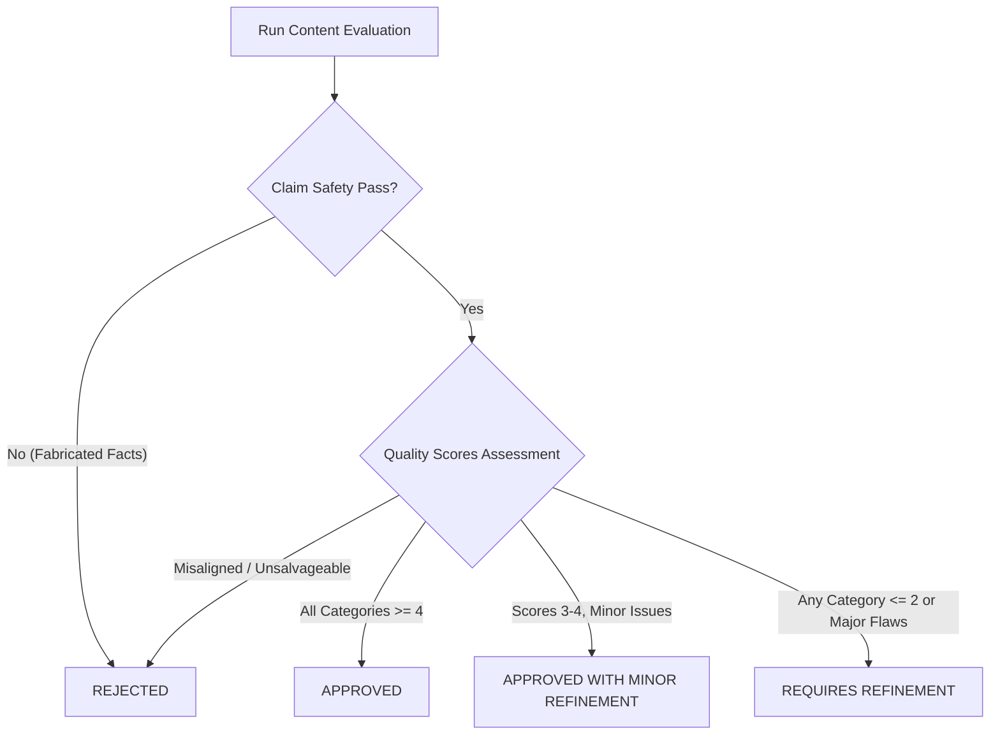
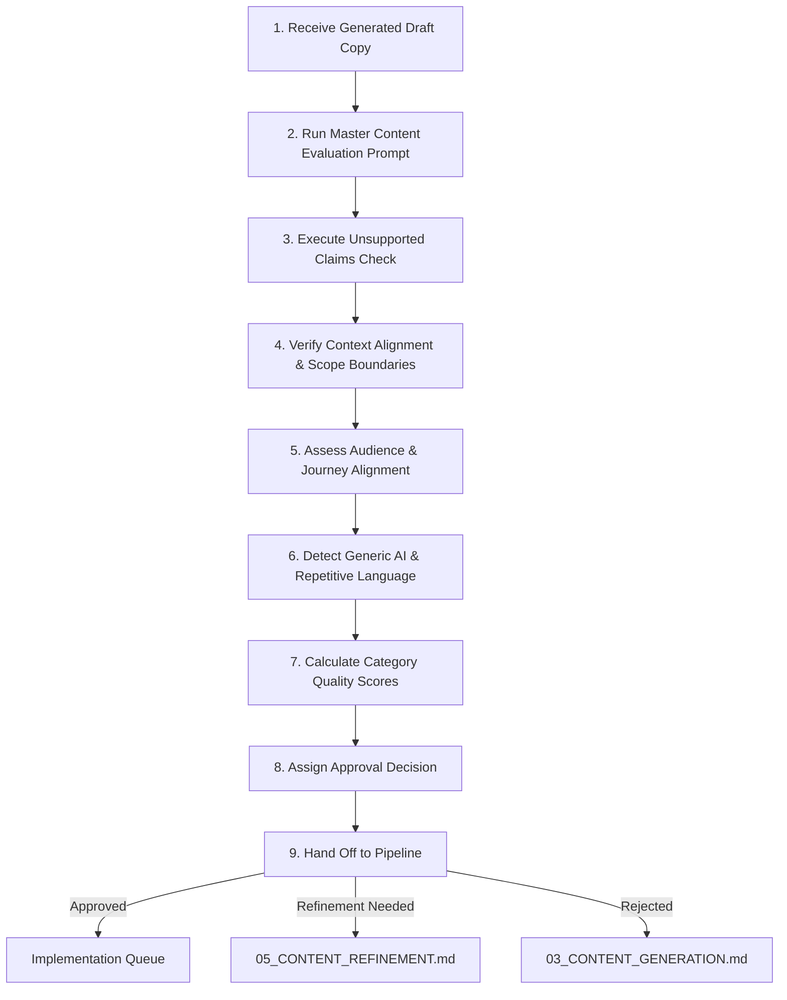

# 04_CONTENT_EVALUATION.md — Reusable Content Evaluation & Audit Prompts

## 1. Purpose

AI-generated copy produced for **Design Haven** must undergo rigorous evaluation before it is approved for refinement or website implementation. 

The purpose of evaluation is not simply to judge whether content sounds polished or visually evocative. The primary objective is to determine whether the content is:
- **Relevant:** Directly aligned with Design Haven’s inspiration-first spatial philosophy.
- **Contextually Accurate:** Free from fabricated company metrics, unverified team claims, or false operational details.
- **Useful to the Target Audience:** Speaks to authentic homeowner mindsets (Creative Homeowners, Renovation Seekers, New Construction Owners, Concept Collaborators) without high-pressure sales rhetoric.
- **Aligned with the User Journey:** Matched to the visitor's current emotional state across the 6-stage journey (*Curiosity → Inspiration → Exploration → Possibility → Confidence → Action*).
- **Free from Unsupported Claims:** Complies strictly with anti-hallucination control guardrails.
- **Clear and Specific:** Uses direct language and tangible spatial concepts rather than empty decorative buzzwords.
- **Appropriate for Its Intended Purpose:** Delivers genuine visual and conceptual value before inviting progressive next actions.

Evaluation acts as a quality gate, preventing generic AI slop, unverified promises, and high-friction sales pitches from reaching production components or refinement pipelines.

---

## 2. Evaluation Principles

All evaluators—whether human editors or AI quality assurance systems—must adhere to these eight foundational principles:

1. **Evaluate Against Project Context:** Always validate content against established project ground truths in `01_BUSINESS_CONTEXT.md`, `02_BRAND_AND_AUDIENCE.md`, `PRD.md`, `TRD.md`, and `APP_FLOW.md`.
2. **Distinguish Verified Facts from Generated Suggestions:** Treat documented project scope as factual baseline, while tagging analytical inferences as hypotheses requiring verification.
3. **Do Not Approve Unsupported Claims:** Instantly flag and reject any fabricated awards, client testimonials, company histories, pricing figures, or team size metrics.
4. **Do Not Approve Content Merely Because It Sounds Polished:** Decorative, high-sounding prose must be rejected if it lacks concrete substance or spatial relevance.
5. **Prioritize Relevance Over Decorative Language:** Favor clear, specific descriptions of layout, light, material, and spatial flow over vague luxury clichés.
6. **Preserve Useful Originality Where Appropriate:** Encourage authentic visual storytelling and unique spatial perspectives that avoid generic marketing templates.
7. **Identify Assumptions Clearly:** Explicitly highlight any unstated premises, implied user needs, or scope extensions introduced in the draft copy.
8. **Evaluate Content Based on Its Intended User Journey Stage:** Judge conversion pressure and information density strictly against the specific stage requirements (*Curiosity* vs. *Confidence*).

---

## 3. Master Content Evaluation Prompt

Use this master prompt to conduct an exhaustive 12-point audit of any AI-generated draft copy for Design Haven.

```markdown
### MASTER CONTENT EVALUATION PROMPT

#### ROLE
You are the Lead Quality Assurance Director and Brand Strategist for Design Haven.

#### PROJECT CONTEXT
Design Haven is an inspiration-first interior design platform for creative homeowners, old home renovators, new build owners, and idea-rich visitors. It operates on a pressure-free collaboration model, guiding users through 6 emotional stages: Curiosity → Inspiration → Exploration → Possibility → Confidence → Action. Ground truth constraints prohibit direct e-commerce, instant checkout pricing, 3D CAD tools, and fabricated company facts (history, awards, testimonials, prices, staff size).

#### CONTENT UNDER REVIEW
"""
{DRAFT_COPY_TEXT}
"""

#### CONTENT TYPE
{CONTENT_TYPE} (e.g., Hero Section, Gallery Story, Service Overview, FAQ, Form Microcopy, CTA)

#### TARGET AUDIENCE
{TARGET_AUDIENCE} (Creative Homeowners | Renovation Seekers | New Construction Owners | Concept Collaborators)

#### USER JOURNEY STAGE
{USER_JOURNEY_STAGE} (Curiosity | Inspiration | Exploration | Possibility | Confidence | Action)

#### CONTENT OBJECTIVE
{CONTENT_OBJECTIVE} (What this specific copy block is intended to accomplish)

#### EVALUATION CRITERIA
Rigorously assess the draft content across the following 12 dimensions:
1. **Context Alignment:** Consistency with Design Haven's core philosophy and scope boundaries.
2. **Audience Alignment:** Relevance to the specified homeowner segment and mindset.
3. **User Journey Alignment:** Appropriateness for the specified journey stage without premature sales pressure.
4. **Clarity:** Ease of understanding, directness, and absence of convoluted phrasing.
5. **Specificity:** Presence of tangible spatial/architectural details rather than generic generalities.
6. **Brand and Communication Consistency:** Sophisticated, encouraging, collaborative, empathetic, and clear tone.
7. **Unsupported Claims:** Presence of unverified company facts, awards, stats, reviews, or prices.
8. **Generic AI Language:** Use of overused LLM clichés ("tapestry", "seamlessly blend", "delve", "beacon").
9. **Repetition:** Redundant wording or repeated value statements.
10. **Conversion Relevance:** Naturalness and pressure-free quality of the suggested next action.
11. **Missing Information:** Essential details or context missing for this stage.
12. **Required Refinement:** Specific actionable adjustments needed for refinement.

*CRITICAL AUDIT RULE:* Do NOT rewrite or re-draft the copy during this evaluation step unless explicitly requested. Focus strictly on audit findings, scores, and refinement directions.

#### OUTPUT FORMAT
Provide your evaluation using the structured Markdown format below:

### 1. Executive Summary
- **Overall Quality Rating:** [Poor | Weak | Acceptable | Strong | Excellent]
- **Approval Status:** [APPROVED | APPROVED WITH MINOR REFINEMENT | REQUIRES REFINEMENT | REJECTED]
- **Primary Finding:** [1-2 sentence summary of core audit outcome]

### 2. Detailed Dimension Assessment
- **1. Context Alignment:** [Evaluation]
- **2. Audience Alignment:** [Evaluation]
- **3. User Journey Alignment:** [Evaluation]
- **4. Clarity:** [Evaluation]
- **5. Specificity:** [Evaluation]
- **6. Brand Consistency:** [Evaluation]
- **7. Unsupported Claims:** [Evaluation - list any flagged claims]
- **8. Generic AI Language:** [Evaluation - list any flagged clichés]
- **9. Repetition:** [Evaluation]
- **10. Conversion Relevance:** [Evaluation]
- **11. Missing Information:** [Evaluation]
- **12. Required Refinement:** [Evaluation]

### 3. Key Refinement Directives
- [Actionable bullet points outlining exact changes for the refinement phase]
```

---

## 4. Context Alignment Prompt

Use this prompt to check whether draft content strictly respects Design Haven's project identity, primary goals, experience principles, and established terminology.

```markdown
### CONTEXT ALIGNMENT PROMPT

#### CONTEXT
Refer to `prompts/01_BUSINESS_CONTEXT.md`, `docs/PRD.md`, and `docs/TRD.md`. Design Haven bridges initial creative ideas and professional execution through an inspiration-first, zero-pressure web experience.

#### TASK
Evaluate the following draft content for alignment with Design Haven's project context:
"""
{DRAFT_COPY_TEXT}
"""

#### EVALUATION REQUIREMENTS
Check alignment against:
- **Project Identity:** Inspiration-first bridge for creative space transformation.
- **Target Audience Scope:** Residential homeowners (existing, renovation, new build, ideators).
- **Primary Goals:** Visual ideation and natural lead conversion.
- **Experience Principles:** Inspire first, zero pressure, progressive disclosure, clarity of next steps.
- **Established Terminology:** Correct usage of terms like "spatial transformation", "guided enquiry", "collaborative methodology".
- **Hard Boundaries:** Zero e-commerce checkout, zero instant pricing calculators, zero 3D CAD modeling.

#### REQUIRED OUTPUT FORMAT
### Aligned Elements
- [List aspects that accurately reflect Design Haven context]

### Misaligned Elements
- [List aspects that conflict with project identity, goals, or boundaries]

### Assumptions Introduced
- [List unstated premises or scope expansions introduced in the copy]

### Missing Context
- [List critical context items that should be present]

### Recommended Action
- [Specific direction to resolve misalignments]
```

---

## 5. Audience Alignment Prompt

Use this prompt to evaluate whether draft content speaks effectively to the target audience context while clearly distinguishing between project facts and analytical hypotheses.

```markdown
### AUDIENCE ALIGNMENT PROMPT

#### CONTEXT
Refer to `prompts/02_BRAND_AND_AUDIENCE.md`. Target categories: Creative Homeowners, Old Home Transformation, Homes Under Construction, Idea-Rich Visitors. Mindset: Creative, cautious, seeking collaborative validation, vulnerable to overwhelm.

#### TASK
Evaluate the following content for audience fit:
"""
{DRAFT_COPY_TEXT}
"""
**Target Audience Segment:** {TARGET_AUDIENCE_SEGMENT}

#### EVALUATION DIMENSIONS
- **Relevance:** Does the copy address authentic spatial realities for this segment?
- **Motivation Alignment:** Does it reflect their core transformation drivers?
- **Aspirational Relevance:** Does it resonate with their visual and identity goals?
- **Clarity:** Is information presented without overwhelming technical jargon?
- **Information Needs:** Does it answer key questions appropriate for their decision stage?
- **Potential Friction:** Does it accidentally trigger fears of losing control, budget ambiguity, or pressure?

#### REQUIRED OUTPUT FORMAT
Provide the assessment using this 4-column Markdown table, ensuring a clear distinction between verified project facts and analytical hypotheses:

| Evaluation Area | Result | Reasoning | Recommendation |
| :--- | :--- | :--- | :--- |
| **Relevance** | [Pass / Concern / Fail] | [Grounding in PRD/Audience facts vs Hypothesis] | [Specific recommendation] |
| **Motivation Alignment** | [Pass / Concern / Fail] | [Grounding in PRD/Audience facts vs Hypothesis] | [Specific recommendation] |
| **Aspirational Relevance**| [Pass / Concern / Fail] | [Grounding in PRD/Audience facts vs Hypothesis] | [Specific recommendation] |
| **Clarity & Jargon** | [Pass / Concern / Fail] | [Grounding in PRD/Audience facts vs Hypothesis] | [Specific recommendation] |
| **Information Needs** | [Pass / Concern / Fail] | [Grounding in PRD/Audience facts vs Hypothesis] | [Specific recommendation] |
| **Potential Friction** | [Pass / Concern / Fail] | [Grounding in PRD/Audience facts vs Hypothesis] | [Specific recommendation] |
```

---

## 6. User Journey Alignment Prompt

Use this prompt to evaluate content against Design Haven’s 6-stage emotional user journey progression.

```markdown
### USER JOURNEY ALIGNMENT PROMPT

#### CONTEXT
Refer to `docs/APP_FLOW.md` and `prompts/02_BRAND_AND_AUDIENCE.md`. Journey progression:
$$\text{Curiosity} \longrightarrow \text{Inspiration} \longrightarrow \text{Exploration} \longrightarrow \text{Possibility} \longrightarrow \text{Confidence} \longrightarrow \text{Action}$$

#### TASK
Evaluate the following content snippet against the intended journey stage:
"""
{DRAFT_COPY_TEXT}
"""
**Intended Journey Stage:** {JOURNEY_STAGE}

#### EVALUATION QUESTIONS
1. **Stage Support:** Does the content effectively support the mindset and goals of this specific stage?
2. **Pacing Check:** Does it attempt to push the user too quickly into a subsequent stage (e.g., hard CTA in Curiosity stage)?
3. **Next Action Appropriateness:** Is the suggested next action unforced, contextual, and natural?
4. **Information Density:** Is the amount and depth of information suitable for this stage without causing fatigue?

#### REQUIRED OUTPUT FORMAT
Present findings in this structured Markdown table:

| Journey Element | Evaluation | Evidence | Recommendation |
| :--- | :--- | :--- | :--- |
| **Stage Mindset Fit** | [Aligned / Misaligned] | [Specific quote or observation from copy] | [Adjustment if misaligned] |
| **Conversion Pacing** | [Appropriate / Premature / Weak] | [Specific quote or observation from copy] | [Adjustment if misaligned] |
| **Suggested Next Action** | [Optimal / Too Pushy / Unclear] | [Specific CTA or link copy analyzed] | [Suggested CTA alternative] |
| **Information Density** | [Balanced / Overwhelming / Sparse] | [Analysis of length and technical depth] | [Pruning or expansion recommendation] |
```

---

## 7. Unsupported Claims Detection Prompt

Use this strict prompt to scan draft content for fabricated, unverified, or policy-violating business claims.

```markdown
### UNSUPPORTED CLAIMS DETECTION PROMPT

#### ROLE
You are a Compliance & Fact-Verification Auditor for Design Haven.

#### STRICT AUDIT RULE
Design Haven enforces a rigid anti-hallucination policy. NO unverified company facts, statistics, awards, pricing, testimonials, or team metrics may appear in content unless explicitly verified in source context files (`01_BUSINESS_CONTEXT.md`, `PRD.md`).

#### TASK
Scan the draft copy below line-by-line for unsupported or fabricated claims:
"""
{DRAFT_COPY_TEXT}
"""

#### SCAN CATEGORIES (CHECK ALL 13 CATEGORIES)
1. **Company History:** (e.g., founding years, legacy stories)
2. **Years of Experience:** (e.g., "over 15 years in design")
3. **Awards & Accolades:** (e.g., "award-winning firm", "best interior design 2024")
4. **Project Counts:** (e.g., "over 500 homes transformed")
5. **Testimonials & Reviews:** (e.g., quoted client statements, star ratings)
6. **Client Names:** (e.g., celebrity or corporate client references)
7. **Addresses & Locations:** (e.g., specific street addresses or physical studio branches)
8. **Certifications:** (e.g., official license numbers, accreditation badges)
9. **Pricing & Costs:** (e.g., specific dollar figures, hourly rates, discount packages)
10. **Guarantees:** (e.g., "100% satisfaction guarantee", "lowest price promise")
11. **Contact Details:** (e.g., unverified phone numbers or direct email addresses)
12. **Team Claims:** (e.g., "team of 50 licensed architects")
13. **Performance Claims:** (e.g., "boost property value by 40%", "fastest turnaround")

#### REQUIRED OUTPUT FORMAT
If unsupported claims are found, itemize them in this table:

| Claim | Claim Type | Supported by Project Context? | Action Required |
| :--- | :--- | :--- | :--- |
| [Exact text snippet] | [Select from 13 categories above] | [No - Unverified] | [Keep / Remove / Replace with neutral wording / Mark for verification] |

*Permissible Actions:*
- **Keep:** Only if fully verified in project context files.
- **Remove:** If completely fabricated and detrimental to trust.
- **Replace with neutral wording:** Reframe to focus on spatial philosophy, user empowerment, or collaborative methodology.
- **Mark for verification:** Highlight for project team review if plausible but unconfirmed.
```

---

## 8. Generic AI Language Detection Prompt

Use this prompt to audit copy for generic AI clichés, empty luxury marketing jargon, corporate filler, and artificial sophistication.

```markdown
### GENERIC AI LANGUAGE DETECTION PROMPT

#### CONTEXT
Design Haven copy must sound authentic, human, sophisticated, and grounded in real architectural realities. AI models frequently introduce empty buzzwords and generic luxury clichés that weaken content credibility.

#### TASK
Scan the draft text for generic AI patterns:
"""
{DRAFT_COPY_TEXT}
"""

#### PATTERNS TO DETECT
- **Empty Superlatives:** "unparalleled elegance", "world-class design", "unrivaled craftsmanship"
- **Generic Luxury Language:** "sanctuary of style", "tapestry of luxury", "opulent aesthetic"
- **Repetitive AI Buzzwords:** "seamlessly blend", "delve into", "beacon of creativity", "game-changer", "testament to"
- **Corporate Jargon:** "synergistic spatial solutions", "holistic design paradigms"
- **Artificial Sophistication:** Overly dramatic sentence structures that say very little
- **Overly Broad Claims:** "transforms every aspect of your life"
- **Filler Sentences:** Sentences that add word count without adding visual or process value
- **Clichéd Marketing Language:** "act now before it's too late", "unlock your dream space today"

*NOTE:* Do NOT automatically rewrite the entire content block. Identify exact problem phrases and explain their weakness.

#### REQUIRED OUTPUT FORMAT
| Content Element | Issue Type | Why It Is Weak | Suggested Refinement Direction |
| :--- | :--- | :--- | :--- |
| [Exact phrase or sentence] | [e.g., Generic Luxury Language] | [Explains why it reduces credibility or clarity] | [Direction for human writer or refinement prompt] |
```

---

## 9. Clarity and Specificity Evaluation Prompt

Use this prompt to evaluate whether copy is easy to understand, direct, and grounded in concrete spatial terms.

```markdown
### CLARITY AND SPECIFICITY EVALUATION PROMPT

#### TASK
Audit the draft text for clarity, sentence complexity, and spatial specificity:
"""
{DRAFT_COPY_TEXT}
"""

#### EVALUATION QUESTIONS
- Is the meaning immediately understandable on a single read?
- Are sentences unnecessarily long, convoluted, or grammatically bloated?
- Are design claims vague (e.g., "beautiful spaces") rather than specific (e.g., "optimizing natural light flow and tactile material transitions")?
- Is key operational or process information missing?
- Can wording be made more direct without losing warmth or sophistication?

#### REQUIRED OUTPUT FORMAT
### Clear Elements
- [List passages that demonstrate high clarity and directness]

### Unclear Elements
- [List confusing or convoluted phrases]

### Vague Elements
- [List generic claims lacking concrete spatial detail]

### Missing Information
- [List essential details the user needs to understand the point]

### Refinement Priorities
1. [First priority fix]
2. [Second priority fix]
3. [Third priority fix]
```

---

## 10. Repetition and Redundancy Prompt

Use this prompt to eliminate duplicate value statements, repeated vocabulary, and redundant CTA phrasing across copy blocks.

```markdown
### REPETITION AND REDUNDANCY PROMPT

#### TASK
Scan the draft copy (or set of copy variants) for redundant language and repeated ideas:
"""
{DRAFT_COPY_TEXT}
"""

#### REPETITION TYPES TO IDENTIFY
- **Repeated Ideas:** Stating the same core benefit multiple times in adjacent paragraphs.
- **Repeated Vocabulary:** Re-using key adjectives (e.g., "distinctive", "cohesive", "curated") multiple times within a short snippet.
- **Duplicate Value Statements:** Over-emphasizing "no pressure" or "collaboration" to the point of sounding defensive.
- **Similar CTA Language:** Multiple CTAs in close proximity using identical wording.
- **Zero-Value Content:** Sentences that repeat the headline without adding new detail.

#### REQUIRED OUTPUT FORMAT
| Repeated Element | Location or Context | Issue | Recommended Action |
| :--- | :--- | :--- | :--- |
| [Phrase / Word / Idea] | [Line number or paragraph] | [e.g., Word used 4x in 50 words] | [Prune / Replace with synonym / Combine sentences] |
```

---

## 11. Conversion Relevance Prompt

Use this prompt to evaluate whether content intended to guide the user toward exploration, understanding, confidence, or enquiry is contextual, natural, and pressure-free.

```markdown
### CONVERSION RELEVANCE PROMPT

#### CONTEXT
Design Haven relies on content-led, progressive conversion. Hard selling, intrusive pop-ups, and premature CTA pressure cause user drop-off. Conversion touchpoints must feel like helpful, natural extensions of the content.

#### TASK
Evaluate the conversion elements in the following content:
"""
{DRAFT_COPY_TEXT}
"""
**Target Journey Stage:** {JOURNEY_STAGE}

#### EVALUATION CHECKLIST
- **Natural Progression:** Does the proposed next step feel like a logical continuation of the reader's thought process?
- **Contextual Relevance:** Is the CTA text directly connected to the section content (e.g., "Explore This Spatial Style" vs "Contact Us")?
- **Conversion Pressure:** Is the pressure appropriate for the current journey stage? (Low in Curiosity/Inspiration; Guided in Confidence/Action).
- **Value-Before-Ask Balance:** Does the content deliver genuine visual or instructional value before presenting an action prompt?
- **Friction Points:** Does the prompt create anxiety around cost, privacy, or unwanted sales calls?

#### REQUIRED OUTPUT FORMAT
### Conversion Strengths
- [List effective, low-friction conversion triggers]

### Conversion Friction
- [List any pushy language, premature asks, or anxiety-inducing copy]

### CTA Relevance
- **Evaluated CTA:** "{CTA_TEXT}"
- **Relevance Rating:** [High | Moderate | Low | Pushy]
- **Assessment:** [Explanation of fit]

### Recommended Adjustment
- [Specific recommendations to soften or optimize conversion touchpoints]
```

---

## 12. Content Quality Scoring Framework

Evaluators must assess content quality using a structured 8-category scoring system. Each category is scored on a 1-to-5 scale according to explicit rubrics:

### Scoring Categories & Rubric

| Category | 1 (Poor) | 2 (Weak) | 3 (Acceptable) | 4 (Strong) | 5 (Excellent) |
| :--- | :--- | :--- | :--- | :--- | :--- |
| **Context Alignment** | Complete conflict with Design Haven identity/scope. | Significant misalignment; introduces out-of-scope concepts. | Basic alignment; minor scope confusion. | Strong alignment with philosophy and boundaries. | Perfect integration of Design Haven context and scope. |
| **Audience Alignment** | Ignores target audience mindset; uses pushy or generic tactics. | Weak resonance; vague or miscalibrated tone. | Satisfies basic audience needs with minor friction. | Speaks directly to homeowner mindset and needs. | Deeply resonates with audience scenario and psychological state. |
| **Journey Alignment** | Completely mis-timed for stage; aggressive premature selling. | Mis-calibrated pacing or information depth. | Adequately matched to stage with minor pacing flaws. | Well-calibrated pacing, info density, and CTAs. | Flawless stage calibration; natural unforced progression. |
| **Clarity** | Incomprehensible, convoluted, or grammatically broken. | Hard to read; complex sentence structures. | Readable; understandable on second pass. | Clear, direct, and easily understood. | Exceptionally lucid, articulate, and effortless to read. |
| **Specificity** | Entirely generic fluff with zero concrete detail. | Mostly vague; few tangible spatial references. | Moderate specificity; some concrete examples. | Highly specific; clear spatial/architectural details. | Vivid, concrete spatial storytelling without fluff. |
| **Claim Safety** | Critical fail: contains multiple fabricated facts/awards/prices. | Contains unverified claims or risky statements. | Free from clear fabrications; contains minor assumptions. | 100% grounded in verified context; zero fabrications. | Perfectly safe; explicitly grounded in context facts. |
| **Originality** | Pure AI slop template; heavy clichés throughout. | Frequent use of generic marketing clichés. | Acceptable wording; standard phrasing. | Fresh, engaging phrasing; minimal clichés. | Distinctive, memorable, highly authentic voice. |
| **Conversion Relevance** | Aggressive, pushy hard sell or completely absent next step. | Awkward or pushy CTA; poorly connected to copy. | Functional CTA; adequate context connection. | Natural, low-friction CTA appropriate for stage. | Masterful content-led conversion prompt. |

### Score Interpretation Rules
- **Numerical Score Definition:**
  - **1 = Poor:** Total failure to satisfy criteria; unusable.
  - **2 = Weak:** Significant flaws requiring major overhaul.
  - **3 = Acceptable:** Meets baseline standards; requires moderate refinement.
  - **4 = Strong:** High quality; needs only minor polishing.
  - **5 = Excellent:** Exemplary benchmark copy ready for implementation.
- *CRITICAL RULE:* The numerical score is a diagnostic tool, **not the sole approval mechanism**. A draft scoring 4.5 overall MUST still be REJECTED if it receives a score of 1 or 2 on **Claim Safety** (containing unverified business facts).

---

## 13. Approval Decision Framework

Evaluation outputs culminate in one of four explicit approval decisions. Each decision dictates specific downstream workflow actions:



### 1. APPROVED
- **Condition:** Content is fully aligned with project context, 100% compliant with claim safety rules (zero fabrications), matched to the user journey stage, free from generic AI language, and scores 4 or 5 across all categories.
- **Next Steps:** Pass draft directly to the website implementation queue or content store (`TRD.md` Section 7).

### 2. APPROVED WITH MINOR REFINEMENT
- **Condition:** Content is fundamentally sound, grounded, and safe (Claim Safety = 5), but requires minor copy polish (e.g., adjusting 1-2 adjectives, trimming a sentence, or fixing CTA microcopy).
- **Next Steps:** Send draft with specific minor refinement notes directly to `05_CONTENT_REFINEMENT.md` for rapid single-pass editing.

### 3. REQUIRES REFINEMENT
- **Condition:** Content demonstrates strong potential and good foundational concepts, but suffers from noticeable flaws (e.g., moderate repetition, generic AI clichés, miscalibrated information density, or minor CTA friction). Claim Safety must be clean.
- **Next Steps:** Forward full Evaluation Audit Report to `05_CONTENT_REFINEMENT.md` for structured multi-pass editing and rewriting.

### 4. REJECTED
- **Condition:** Content is fundamentally misaligned with Design Haven scope, contains unverified/hallucinated business claims (Claim Safety ≤ 2), uses high-pressure sales rhetoric, or scores Poor/Weak across multiple categories.
- **Next Steps:** Discard the draft copy entirely. Re-examine business context in `01_BUSINESS_CONTEXT.md` and re-execute generation using tighter constraints in `03_CONTENT_GENERATION.md`.

---

## 14. Full Evaluation Output Template

When executing a comprehensive evaluation, evaluators must produce a complete audit report using the following standard Markdown template:

````markdown
# Content Evaluation Audit Report

## 1. Content Summary
- **Target Section / Asset:** {TARGET_SECTION}
- **Content Type:** {CONTENT_TYPE}
- **Target Audience:** {TARGET_AUDIENCE}
- **User Journey Stage:** {USER_JOURNEY_STAGE}
- **Evaluator:** {EVALUATOR_NAME_OR_ROLE}
- **Evaluation Date:** {DATE}

---

## 2. Context Alignment
- **Identity & Scope Fit:** [Detailed findings on alignment with inspiration-first philosophy and scope boundaries]
- **Operational Boundaries:** [Verified zero e-commerce, instant pricing, or 3D CAD references]

---

## 3. Audience Alignment
- **Mindset Fit:** [Detailed findings on resonance with homeowner psychological state]
- **Information Utility:** [Evaluation of practical and aspirational value delivered]

---

## 4. User Journey Alignment
- **Stage Calibration:** [Analysis of fit with {USER_JOURNEY_STAGE} stage]
- **Pacing & Pressure:** [Assessment of conversion pressure and next action fit]

---

## 5. Unsupported Claims Audit
- **Safety Status:** [CLEAN / FLAGGED CLAIMS PRESENT]
- **Flagged Claims Detail:**
| Claim Text | Category | Fact Status | Action |
| :--- | :--- | :--- | :--- |
| [None or text] | [N/A or category] | [Verified / Unverified] | [Keep / Remove / Neutralize] |

---

## 6. Generic AI Language Audit
- **Cliché Status:** [CLEAN / GENERIC AI LANGUAGE DETECTED]
- **Flagged Phrases Detail:**
| Flagged Text | Cliché Category | Why It Weakens Content | Refinement Direction |
| :--- | :--- | :--- | :--- |
| [None or text] | [Category] | [Explanation] | [Direction] |

---

## 7. Clarity and Specificity
- **Readability & Directness:** [Assessment of sentence clarity and flow]
- **Spatial Specificity:** [Evaluation of concrete architectural/design details]

---

## 8. Repetition & Redundancy
- **Redundancy Findings:** [Analysis of repeated words, duplicate value statements, or redundant sentences]

---

## 9. Conversion Relevance
- **Next Action Assessment:** [Evaluation of CTA contextual relevance and friction level]

---

## 10. Quality Scores

| Category | Score (1-5) | Summary Rationale |
| :--- | :---: | :--- |
| Context Alignment | / 5 | [Rationale] |
| Audience Alignment | / 5 | [Rationale] |
| Journey Alignment | / 5 | [Rationale] |
| Clarity | / 5 | [Rationale] |
| Specificity | / 5 | [Rationale] |
| Claim Safety | / 5 | [Rationale] |
| Originality | / 5 | [Rationale] |
| Conversion Relevance | / 5 | [Rationale] |
| **Overall Weighted Score** | **/ 5.0** | **Status:** [APPROVED / APP WITH MINOR / REQUIRES REF / REJECTED] |

---

## 11. Approval Decision
**FINAL DECISION:** [APPROVED | APPROVED WITH MINOR REFINEMENT | REQUIRES REFINEMENT | REJECTED]

---

## 12. Required Refinements
1. [Specific line-item instruction for refinement step]
2. [Specific line-item instruction for refinement step]
3. [Specific line-item instruction for refinement step]

---

## 13. Missing Information or Validation Needs
- **Missing Information:** [Essential copy or process details that need to be added]
- **Validation Needs:** [Business or technical details requiring project team confirmation]
````

---

## 15. Evaluation Guardrails

Evaluators must strictly observe the following eight non-negotiable guardrails during every content audit:

1. **Do Not Fabricate Evidence:** Never invent flaws or imagine misalignments that are not present in the draft copy.
2. **Do Not Treat Hypotheses as Facts:** Maintain a strict distinction between verified project context facts (from PRD/TRD) and analytical hypotheses.
3. **Do Not Approve Unsupported Claims:** Never pass content containing unverified company history, team size, awards, client lists, or pricing promises.
4. **Do Not Rewrite Unless Refinement Is Explicitly Requested:** Keep the evaluation phase focused purely on auditing, scoring, and directing; preserve copy writing for generation/refinement modules.
5. **Do Not Reject Content Merely Because It Is Unconventional:** Creative, fresh, or unique visual metaphors should be embraced as long as they remain clear, safe, and contextually aligned.
6. **Explain the Reasoning Behind Important Evaluation Findings:** Always provide empirical rationale for low scores, flagged phrases, or rejection decisions.
7. **Keep Evaluation Tied to Documented Project Objectives:** Base all judgments on Design Haven's core goals of inspiration, trust building, and pressure-free lead conversion.
8. **Preserve the Distinction Between Verified Facts, Assumptions, and Suggestions:** Ensure audit reports clearly categorize findings so refinement authors know what is mandatory vs optional.

---

## 16. Evaluation Workflow

The content evaluation process executes via the following sequential workflow:



1. **Generate Draft:** Receive candidate draft copy from `03_CONTENT_GENERATION.md`.
2. **Run Master Evaluation:** Execute Section 3 Master Evaluation Prompt for comprehensive initial assessment.
3. **Check Claims:** Execute Section 7 Unsupported Claims Prompt to audit against the 13 prohibited hallucination categories.
4. **Check Context:** Execute Section 4 Context Alignment Prompt to verify alignment with Design Haven identity, goals, and scope.
5. **Check Audience and Journey Alignment:** Execute Sections 5 & 6 to audit psychological fit, stage pacing, and CTA friction.
6. **Detect Generic or Repetitive Language:** Execute Sections 8, 9, & 10 to identify LLM clichés, vague phrasing, and redundant vocabulary.
7. **Score Content:** Apply Section 12 Quality Scoring Framework across all 8 evaluation categories.
8. **Assign Approval Decision:** Apply Section 13 Approval Decision Framework to determine status (Approved, Approved with Minor Refinement, Requires Refinement, Rejected).
9. **Send Approved Feedback to Refinement:** Route output and audit report to appropriate downstream handler (Implementation Queue, Refinement, or Re-generation).

---

## 17. Quick Reference Summary

| Evaluation Prompt / Tool | Primary Purpose | Key Output |
| :--- | :--- | :--- |
| **Master Content Evaluation** | Comprehensive 12-point audit of draft copy against Design Haven standards. | Executive summary, 12-point dimension assessment, and refinement directives. |
| **Context Alignment** | Verifies consistency with project identity, primary goals, principles, and scope. | Itemized list: Aligned Elements, Misaligned Elements, Assumptions, Action. |
| **Audience Alignment** | Assesses fit for specific homeowner segment mindset and information needs. | 4-column table: Evaluation Area, Result, Fact vs Hypothesis Reasoning, Recommendation. |
| **User Journey Alignment** | Evaluates copy fit, pacing, density, and CTA fit against 6 journey stages. | 4-column table: Journey Element, Evaluation, Evidence, Recommendation. |
| **Unsupported Claims Detection** | Strict anti-hallucination scan across 13 prohibited business claim categories. | 4-column table: Claim, Claim Type, Supported Status, Required Action. |
| **Generic AI Language Detection** | Audits copy for empty superlatives, luxury clichés, corporate jargon, and filler. | 4-column table: Content Element, Issue Type, Weakness Rationale, Refinement Direction. |
| **Clarity and Specificity** | Evaluates sentence directness, readability, missing info, and spatial details. | Itemized sections: Clear, Unclear, Vague, Missing Info, Refinement Priorities. |
| **Repetition Detection** | Identifies redundant phrasing, vocabulary overuse, and duplicate value statements. | 4-column table: Repeated Element, Location, Issue, Recommended Action. |
| **Conversion Relevance** | Audits contextual CTAs, conversion pressure, value-before-ask balance, and friction. | Itemized sections: Conversion Strengths, Friction, CTA Relevance, Recommended Adjustment. |
| **Quality Scoring** | Evaluates draft across 8 core categories using explicit 1-5 rubrics. | Structured 8-category scorecard with 1-5 ratings and weighted overall score. |
| **Approval Decision** | Assigns final workflow decision (Approved, Minor Refine, Requires Refine, Rejected). | Clear approval status determination with explicit downstream workflow triggers. |
